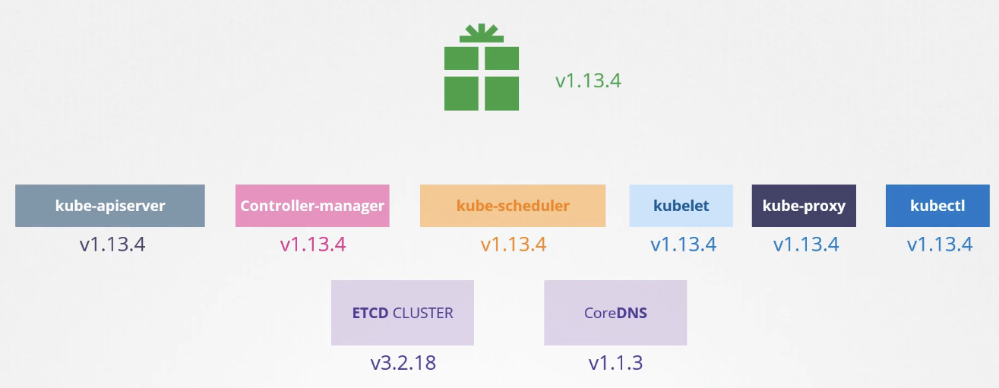
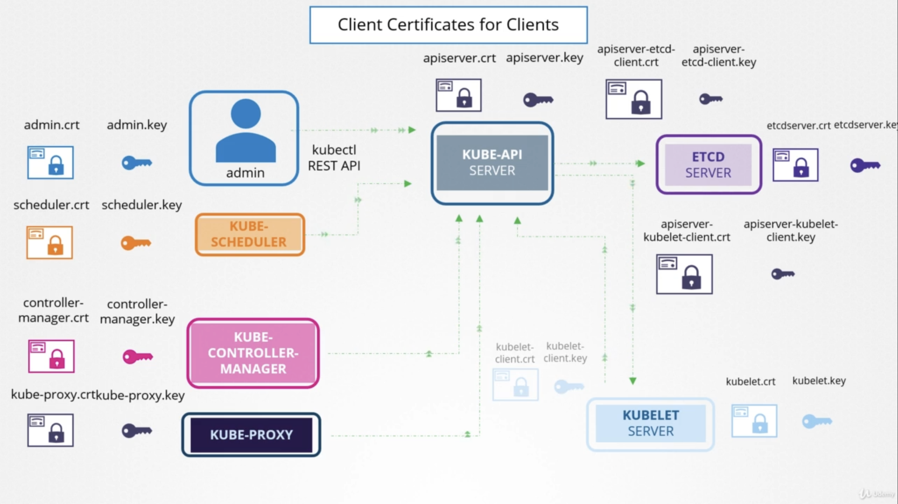
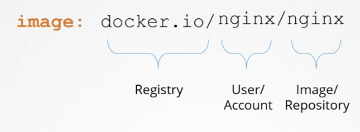
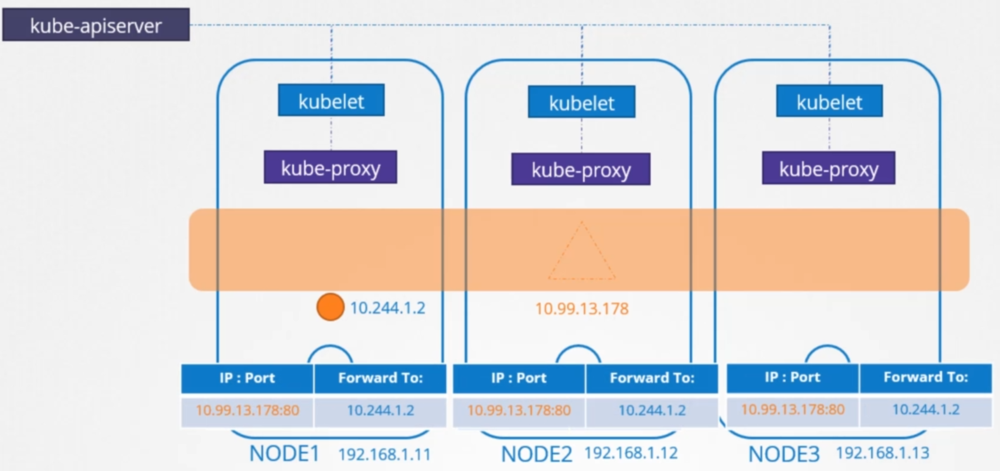
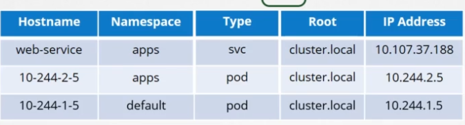

# Introduction

I wanted to share my notes on the recent course I watched preparing for the [CKA Exam](https://www.cncf.io/certification/cka/).

[Certified Kubernetes Administrator (CKA) Practice Exam Tests](https://www.udemy.com/course/certified-kubernetes-administrator-with-practice-tests/)

The course is well-made and extremely detailed. The free practice labs are a great help as well, hands-on is always best, a belief I have had for years as can be seen by an old tweet of mine.

:::note
These notes shouldn't replace notes you would take yourself!
:::

As with other similar notes I have done ([AWS Well-Architected Framework Notes](https://ddulic.dev/aws-well-architected-framework-notes)) these notes are mostly for me, but I decided to take the minimal effort to open them up in the hopes that someone else finds them useful as well.

I also want to make a note that this is not a preparation guide or my thoughts on CKA Exam itself, I might do another post on that later down the line...

As for the somewhat weird format... I use the Second Brain Methodology for organizing all my notes, the **bolding** (layer 2) and highlighting (layer 3) is part of [Progressive Summarization](https://fortelabs.co/blog/progressive-summarization-a-practical-technique-for-designing-discoverable-notes). I won't go into the details of what this exactly is and how it works, if you are interested, check out the link.

---

. o O and yes, I have passed the CKA Exam. You can view my certificate [here](https://www.credly.com/badges/a8557330-76a2-4079-bb95-52063b34ea93).

---

# Useful Resources

Some blog posts I read up before to prepare for the Exam (grabbed from [Pocket](https://getpocket.com))

- [Strategy: How to pass CKA Exam with less stress | vMantra.in](https://vmantra.in/strategy-how-to-pass-cka-exam-with-less-stress)
- [My experience passing CKA and CKAD](https://web.archive.org/web/20210227000628/https://blog.cuffaro.com/blog/2021/01/24/cka-ckad)
- [Be fast with Kubectl 1.18 (CKAD/CKA)](https://faun.pub/be-fast-with-kubectl-1-18-ckad-cka-31be00acc443)

# Core Concepts

## Kube-API Server is used for

- Authenticating Users
- Validating Requests
- Retrieving Data
- **Updating ETCD (kube-apiserver is the only one that communicates with it)**
- Scheduler, `kubectl` uses the api to update the cluster

## Kube Controller Manager

- **Watches the status of various system components**
- Remediates the situation if required
- Node Controller
    - **The node monitor checks the node status every 5 seconds**
    - **If a node misses a heartbeat, it waits for 40 seconds before marking it unreachable**
    - **After 5 minutes of being unreachable, it will kill the node**
- Replication Controller
    - Checks the number of pods in the set, if a pod dies it creates another one
- There are many controllers available in k8s, some examples include:
    - Deployment Controller
    - Namespace Controller
    - Endpoint Controller
    - Job Controller
    - Service Account Controller
    - etc...
- By default, all are enabled, you need to specifically disable controllers if you don't want them

## Kube Scheduler

- Only responsible for deciding which pod goes to which node
- Checks labels, space allocations, memory, cpu on the node
- **Kube Scheduler looks at each pod and makes sure to find the best node for the pod**
- It first filters out the nodes that don't match the pod's requirements
- **It then ranks the nodes via a priority function to give a node a score of 1 to 10**
- **Custom schedulers can also be written and applied**

## Kubelet

- **"Captain of the Ship"**
- The sole point of contact with the master
- **Sends back regular reports on the node**
- **Communicates with the container runtime engine to manage pods**

:::note
Kubeadm does not deploy kubelets
:::

## Kube-proxy

:::note
Not actually a proxy
:::

- **It manages services, they are virtual components that live in the k8s memory**
- `kube-proxy` is a process that runs on each node in the cluster
- **Its job is to look for new services, when a new service is created it manages the rules to forward traffic to the pods**
- **It does this using `iptable` rules by default**
- `kube-proxy` is deployed as a deamonset, meaning it will get deployed to each node

## ReplicaSets

:::note
ReplicaitonController IS NOT a ReplicaSet. ReplicaSets are newer and replace ReplicationControllers
:::

```bash
kubectl get replicaset
```

**`ReplicaSet` can be used to monitor existing deployed pods.**

```bash
kubectl scale --replicas=6 replicaset myapp-replicaset
```

## Deployments

**Deployments create ReplicaSets.**

We can use the below command to see EVERYTHING deployed to the cluster

```bash
kubectl get all
```

**Generate POD Manifest YAML file (`-o yaml`). Don't create it(`--dry-run=client`)**

```bash
kubectl run nginx --image=nginx --dry-run=client -o yaml
```

**Generate Deployment YAML file (`-o yaml`). Don't create it(`--dry-run=client`)**

```bash
kubectl create deployment --image=nginx nginx --dry-run=client -o yaml
```

## Namespace

**We can set a `ResourceQuota` on the NS to limit the number of pods, cpu and memory limits and requests that can be created there.**

## Service

Multiple types of services:

- **NodePort (ports available are 30000 - 32767)**
- **ClusterIP (default type, mainly used for backend-services)**
- **LoadBalancer (used for exposing one endpoint for all nodes)**

**We can use `expose deployment` to create a svc**

```bash
kubectl expose deployment simple-webapp-deployment --name=webapp-service --target-port=8080 --type=NodePort --port=8080 --dry-run=client -o yaml
```

## Imperative vs Declarative


:::note
kubectl create is imperative and kubectl apply is declarative.
:::

Create a Service named redis-service of type ClusterIP to expose pod redis on port 6379

```bash
kubectl expose pod redis --port=6379 --name redis-service --dry-run=client -o yaml
```

:::warning
WE CAN'T MIX IMPERATIVE AND DECLARATIVE COMMANDS
:::


## Kubernetes YAML Manifest

The following fields are required:

- apiVersion (string)
- kind (string)
- metadata (dict)
- spec (dict)

# Scheduling

## Manual Scheduling

**You can manually assign an UNDEPLOYED POD to a node with `.spec.nodeName`**

If it is already deployed (in a "Pending" state), you need to create a `kind: Binding`

```yaml
apiVersion: v1
kind: Binding
metadata:
  name: nginx
target:
  apiVersion: v1
  kind: Node
  name: node02
```

The above yaml needs to be converted to json and send via `POST` to the api server.

## Labels and Selectors

There is no limit to the number of labels that your object can have

To select a label you pass the `--selector` flag, for example

```bash
kubectl get pods --selector app=App1
```

The selector can also be used in the manifest under `.spec`

You can check for multiple labels with

```bash
**kubectl get pod --all-namespaces --selector bu=finance,tier=frontend,env=prod**
```

## Taints and Tolerations

**By default, no pod can tolerate ANY tainted note. Only when we add toleration on a pod we can place that pod on a Node.**

- **Taints are set on Nodes**
- **Tolerations are set on Pods**

```bash
kubectl taint nodes node-name key=value:taint-effect
```

**`taint-effect` denotes what would happen to the pods if they do not tolerate the taint**

**There are 3 taint effects:**

- **NoSchedule**
- **PreferNoSchedule**
- **NoExecute**

```yaml
apiVersion:
kind: Pod
metadata:
  name: myapp-pod
spec:
  containers:
  - name: nginx-container
    image: nginx
  tolerations:
  - key: "app"
    operator: "Equal"
    value: "blue"
    effect: "NoSchedule"
```

:::note
Taints and toleration don't tell a pod to go to a specific Node, it instead tells Nodes not to accept certain pods!
:::

**The scheduler doesn't schedule any pods on the Master node as there is a Taint set by default when setting up the cluster. This is the best practice!** To see this taint run the following

```bash
kubectl describe node kubemaster | grep Taint
```

```bash
kubectl explain pod --recursive | less
```

```bash
kubectl explain pod --recursive | grep -A5 tolerations
```

**To remove a taint, you add an `-` at the end of the command**

```bash
kubetl taint node master node-role.kubernetes.io/master:NoSchedule-
```

## Node Selectors

**We can put limitations on pods, so they go on specific pods, it is `.spec.nodeSelector`. Selectors use labels.**

Node selectors have the limitation that they are simple and have no advanced logic, for this we need to use the below NodeAffinity and AntiAffinity.

## Node Affinity

The main feature is that pods are hosted on specific nodes. It provides advanced capability compared to the NodeSelector.

`.spec.affinity.nodeAffinity`

Use `operator: Exists` if you only want to match on a key.

## Resource Requirements and Limits

**The** s**cheduler looks at how many resources a pod requires and places the pod on a node with sufficient resources.**

**If there is no room on a node, the pod will get stuck in a “Pending” state stating it lacks resources.**

1 count of CPU if equal to 1 vCPU.

**A container by default has a limit of 1 vCPU (number of resources it can consume on a node, that is, the limit), and a limit of 512 Mi of memory.**

**Limits are set for each container in the pod. If a container wants to use more CPU, it gets throttled, if it tries to use more memory (it is allowed up a point if it does this constantly, it gets killed).**

- [https://kubernetes.io/docs/tasks/administer-cluster/manage-resources/memory-default-namespace/](https://kubernetes.io/docs/tasks/administer-cluster/manage-resources/memory-default-namespace/)
- [https://kubernetes.io/docs/tasks/administer-cluster/manage-resources/cpu-default-namespace/](https://kubernetes.io/docs/tasks/administer-cluster/manage-resources/cpu-default-namespace/)

## DaemonSets

**`DaemonSets` guarantee us that one instance of the pod is always on a Node.**

This is useful for monitoring and logging agents.

**kube-proxy can be deployed as a DaemonSet on the cluster, as well as some CNIs.**

**The yaml is almost the same as a `ReplicaSet` and `Deployments`, the only difference is the `kind`.**

From k8s 1.12 onward, `DaemonSets` use NodeAffinity and the default scheduler to schedule pods on the Nodes.

To quickly create a DS, we can use `kubectl create deployment` to create a deployment yaml and modify it to be a DS.

## Static Pods

**You can configure the kubelet to periodically check a folder on the node to automatically deploy the pod manifests that are in that folder.**

**This folder can be any directory, the option is passed to the kubelet on launch with `--pod-manifest-path` or set it in `kubeconfig.yaml` as `staticPodPath`.**

kubelet can take instructions to create pods from different sources.

**The static pods get listed as any other pod, it is just a read-only mirror though that gets pushed to the API server.**

**You might want to use static pods to deploy the control plane components for example (api-server, controller, etcd).**

Show the config file for the kubelet

```bash
ps -ef | grep kubelet
```

```bash
systemctl cat kubelet.service
```

## Multiple Schedulers

You can make k8s use multiple schedulers, even custom ones.

**When making a pod or deployment you can set which scheduler you want to use.**

We can add a custom scheduler by specifying the below when launching the scheduler as a pod

```bash
- --scheduler-name=my-custom-scheduler
- --lock-object-name=my-custom-scheduler
```

We then specify the below in a pod or deploy manifest to select our custom scheduler

```bash
schedulerName: my-custom-scheduler
```

We can see the logs of the scheduler with

```bash
kubectl logs my-custom-scheduler --name-space=kube-system
```

# Logging and Monitoring

## Monitor Cluster Components

**We have Metrics Server (formally Heapster) that we can use to monitor k8s.**

**The metrics server is in-memory, so you can't see historical data.**

The metrics are generated from the agent on the Node (cAdvisor in kubelet).

We need to enable the server manually by cloning and applying the git repo on the cluster. We can then use the below command to view the CPU and memory consumption.

```bash
kubectl top node
```

```bash
kubectl top pod
```

## Managing Application Logs

**To get logs from a pod, run (append, `-c container-name` if you have multiple containers in a pod)**

```bash
kubectl logs -f pod-name
```

# Application Lifecycle Management

## Rolling Updates and Rollbacks

You can see the status of the rollouts with

```bash
**kubectl rollout status deployment/myapp-deployment**
```

You can see the history with

```bash
**kubectl rollout history deployment/myapp-deployment**
```

**There are 2 types of deployment strategies:**

1. **Recreate (destroy all and deploy new instances, causes downtime, not default)**
2. **Rolling Update (taking down old and bringing up new version one by one, causes no downtime, default)**

You can trigger an update by updating the image of the deployment with `kubectl set image deployment/myapp-deployment nginx=nginx:1.9.1`

The upgrades create a `replicaSet` automatically.

You can roll back to a previous revision with

```bash
kubectl rollout undo deployment/myapp-deployment
```

## Commands

**A container only lives as long as the process inside it lives.**

In the Dockerfile, we should specify both `ENTRYPOINT` and `CMD`

```docker
FROM Ubuntu

ENTRYPOINT ["sleep"]

CMD ["5"]
```

```yaml
apiVersion: v1
kind: Pod
metadata:
  name: ubuntu-sleeper-pod
spec:
  containers:
  - name: ubuntu-sleeper
    image: ubuntu-sleeper
    command: ["sleep2.0"]
    args: ["10"]
```

The `spec.containers.command` field corresponds to `--entrypoint` in the Dockerfile

## ConfigMaps

They are used for passing config data in the form of key value pairs as env variables.

```bash
**kubectl create configmap app-config --from-literal=APP_COLOR=blue**
```

`.spec` is replaced with `.data`

```yaml
apiVersion: v1
kind: ConfigMap
metadata:
  name: app-config
data:
  APP COLOR: blue
  APP MODE: prod
```

```yaml
spec:
  containers:
  - name: simple-webapp-color
    image: simple-webapp-color
    ports:
    - containerPort: 8080
    envFrom:
    - configMapRef:
        name: app-config
```

## Secrets

```bash
kubectl create secret generic app-secret --from-literal=DB_Host=mysql
```

Uses the same `data` field as ConfigMaps.

**When creating a Secret in declarative form, we should encode the values to base64**

```bash
echo -n "mysql" | base64
```

`kubectl describe secret1` to view the values and `kubectl get secret -o yaml`

To decode it run `echo -n "==483jhad" | base64 --decode`

To specify a secret in a manifest

```yaml
spec:
  containers:
  - name: simple-webapp-color
    image: simple-webapp-color
    ports:
    - containerPort: 8080
    envFrom:
    - secretRef:
        name: app-config
```

We can use `secretRef` for a whole secret file or `secretKeyRef` for a single value.

We can also insert secrets as a volume

```yaml
volumes:
- name : app-secret-volume
  secret:
    secretName: app-secret
```

For the volume, each secret is created as a file on the system.

---

**The way Kubernetes handles secrets:**

- **A secret is only sent to a node if a pod on that node requires it**
- **Kubelet stores the secret into a tmpfs so that the secret is not written to disk storage**
- **Once the Pod that depends on the secret is deleted, kubelet will delete its local copy of the secret data as well**

## InitContainers

```yaml
apiVersion: v1
kind: Pod
metadata:
  name: myapp-pod
  labels:
    app: myapp
spec:
  containers:
  - name: myapp-container
    image: busybox:1.28
    command: ['sh', '-c', 'echo The app is running! && sleep 3600']
  initContainers:
  - name: init-myservice
    image: busybox
    command: ['sh', '-c', 'git clone <some-repository-that-will-
```

**When a POD is first created the `initContainer` is run, and the process in the initContainer must run to completion before the real container hosting the application starts.**

**You can configure multiple such initContainers as well, like how we did for multi-pod containers. In that case, each init container is run one at a time in sequential order.**

**If any of the initContainers fail to complete, Kubernetes restarts the Pod repeatedly until the init Container succeeds.**

# Cluster Maintenance

## OS Upgrades

`kube-controller-manager --pod-eviction-timeout=5m0s` is the amount of time the master waits before considering the node dead.

`kubectl drain node` automatically sets the node to `cordon` mode, and the scheduler will not put any pods on it

## Kubernetes Software Versions

- `major.minor.patch` (1.11.3 for example)
- 1.0 was released in July 2015



## Cluster Upgrade Process

**The k8s components can be at different versions, but they can't be higher than the API Server.**

- controller-manager and kube scheduler can be `x-1`
- kubelet and kube-proxy can be `x-2`
- kubectl can be x+1 > x-1 (this is for live upgrading)

:::warning
You should always upgrade one minor version at a time.
:::

The upgrade process depends on the cluster setup, GKE and EKS allow for easier upgrading.

**If the master is down, all workloads continue to run, it is if resources go down that they will not be automatically brought back up!**

```bash
apt-get upgrade -y kubeadm=1.12.0
kubeadp upgrade apply v1.12.0
---
apt-get upgrade -y kubelet=1.12.0
systemctl restart kubelet
---
kubectl drain node-1
apt-get upgrade -y kubelet=1.12.0
apt-get upgrade -y kubeadm=1.12.0
kubeadm upgrade node config --kubelet-version v.1.12.0
systemctl restart kubelet
kubectl uncordon node-1
```

## Backup and Restore Methods

We should keep everything in yaml (declarative), usually in GitHub.

**We can also query the API server and save all configs, for example for the namespace's resource groups**

```bash
kubectl get all -A -o yaml > all-deploy-services.yaml
```

There are tools like Valero that can help us do backups using the k8s API.

**The ETCD cluster stores info about the cluster, nodes and resources. We can just backup this server (hosted on the master node).** We need to backup the `—data-dir` or we can use

```bash
ETCDCTL_API=3 etcdctl snapshot save snapshot.db
---
ETCDCTL_API=3 etcdctl snapshot status snapshot.db
---
systemctl stop kube-apiserver
ETCDCTL_API=3 etcdctl snapshot restore snapshot-db --data-dir /var/lib/etcd-from-backup
# after that we configure the etcd service to use the new location
systemctl start kube-apiserver
```

We need to specify the endpoints, cacert, cert and key with all `etcdctl` commands.

# Security

## Kubernetes Security Primitives

All the communication to the cluster and between the cluster components is secured with TLS.

## Authentication

**There are two types of users:**

- **Users (humans)**
- **Service Accounts (bots)**

The API server authenticates the request before processing it, you can have passwords or tokens in a file or auth with certs, or even use LDAP.

:::note
This Basic Auth is deprecated in Kubernetes 1.19...
:::

Static Password/Token Files, this uses a `.csv` file, and we pass it to the kube-apiserver.

To authenticate via this method, pass the user info via the request

```bash
curl -v -k https://master-node-ip:6443/api/v1/pods -u "user1:password123"
```

For the token, we use `Authorization: Bearer TOKEN`.

## TLS in Kubernetes

A certificate is used to guarantee trust between parties in a transaction.

Usually, certificates with public keys are named `.crt` or `.pem`, certificate keys are named `.key` or `*-key.pem`.

The following SERVER components have certificates:

- kube-apiserver
- etcd
- kubelet (nodes)

The following CLIENT components have certificates:

- user (admin)
- kube-scheduler
- kube-controller-manager
- kube-proxy



---

You can use numerous tools to generate certificates, some examples:

- easyrsa
- openssl
- cfssl

Once you have the client certificates, you can manually curl the API Server by passing the info in a curl

```bash
curl https://kube-apiserver:6443/api/v1/pods --key admin.key --cert admin.crt --cacert ca.crt
```

Or, preferably, you can store this in `kube-config.yaml`.

Each node also requires a `kube-config.yaml` to connect to the master controlplane. The nodes also need to be added to the `SYSTEM:NODES` certificate group.

## View Certificates

**We need to understand how the cluster was set up, so we know where to look for certificates.**

**In a `kubeadm` environment, we can look at the pods deployed, specifically the `command` and `volumes` section.**

**We can then inspect the certificate with `openssl`**

```bash
openss1 x509 -in /etc/kubernetes/pki/apiserver.crt -text -noout
```

Within the output, we look at:

- expiry
- subject
- issuer
- organization
- alternative subject names

We should also look at the logs

```bash
kubectl logs etcd-master
```

But if some components are offline, we can use Docker to view the logs

```bash
docker ps -a
docker logs <containerID>
```

## Certificate API

We can send a CRS to the controlplane with an API, making it easier to generate certificates, the process is as follows:

1. Create CertificateSigningRequest Object
2. Review Requests (`kubectl get csr`)
3. Approve Requests (`kubectl certificate approve <name>`)
4. Share Certs to users (`kubectl get csr <name> -o yaml`and proceed to `base64 --decode`)

The controller-manager is the one who carries out these tasks.

## KubeConfig

**The KubeConfig has 3 sections:**

1. **Clusters**
2. **Contexts**
3. **Users**

Each of these sections is an array, so we can define multiple items.

**Contexts define which users should access which cluster.**

You are using existing users on the cluster and defining existing privileges, you are not creating new access with this file.

User `kubectl config view` to view the full config.

Change the context with `kubectl config use-context user@environment`.

## API Groups

**You can use `kubectl proxy` to access the API on localhost or alternatively pass the certs in the query.**

**The k8s API is grouped into multiple groups, based on their purpose**, for example

- `/version`
- `/api`
    - Core Group that contains core functionality
    - `/v1`
        - `namespaces`
        - `pods`
        - `secrets`
        - etc...
- `/apis`
    - Named Group
    - More organized
    - All newer features will be available through these named groups
    - Everything directly underneath here are **API Groups**
    - Elements nested under API Groups are **Resources**
    - Elemenets under Resources are **Actions**
    - `/apps`
        - `/v1`
            - `/deployments` (Resource)
            - `/replicasets` (Resource)
            - `/statefulsets` (Resource)
                - list (Verb)
                - get (Verb)
                - create (Verb)
                - etc...
    - `/extensions`
    - `/networking.k8s.io`
        - `/v1`
            - `/networkpolicies` (Resource)
    - `/storage.k8s.io`
    - etc...
- `/metrics`
- `/healthz`
- `/logs`
- etc...

## Authorization

**There are different modes of authorization in Kubernetes:**

- **AlwaysAllow**
- **Node (node authorizer, `system:node:*` group)**
- **ABAC (external access, attribute-based auth)**
- **RBAC (external access, role-based auth, roles and permissions and associate users to these roles)**
- **Webhook (can be used for outsourcing auth, for example, OPA)**
- **AlwaysDeny**

**These modes are set using the `-authorization-mode` on the Kube API Server, the default is `AlwaysAllow`, you can also enable multiple nodes with a `,`(if you have multiple, the order is left to right).**

## Role-Based Access Controls

**We create Roles by creating Role Objects. Each rule has 3 sections:**

- **apiGroups**
- **resources**
- **verbs**

```yaml
apiVersion: rbac.authorization.k8s.io/v1
kind: Role
metadata:
  name: developer
rules:
- apiGroups: [""]
  resources: ["pods"]
  verbs: ["list", "get", "create", "update", "delete"]
```

You can add multiple rules per Role.

```bash
kubectl create -f developer-role.yaml
```

We now need to link the user to the Role, for this we use RoleBinding

```yaml
apiVersion: rbac.authorization.k8s.io/vl
kind: RoleBinding
metadata:
  name: devuser-developer-binding
subjects:
- kind: User
  name: dev-user
  apiGroup: rbac.authorization.k8s.io
roleRef:
  kind: Role
  name: developer
  apiGrop: rbac.authorization.k8s.io
```

**The Roles and Role binding fall under the scope of namespaces**, the above yamls are for the `default` namespace.

```bash
kubectl get roles
kubectl get rolebindings
kubectl describe role <role-name>
kubectl describe rolebinding <rolebinding-name>
```

If we want to see if a user can do specific commands, we can do

```bash
kubectl auth can-i create deployments
kubectl auth can-i delete nodes
```

Admins can also use the command as other users

```bash
kubectl auth can-i create pods --as dev-user --namespace test
```

## Cluster Roles and Role Bindings

**Same as above, but on a cluster level, so they can include nodes, namespaces, PV, etc...**

For example:

- view nodes, deletes nodes
- create PVs, delete PVs

**Kubernetes creates a number of Cluster Roles and Cluster Role Bindings when the cluster is the first setup.**

## Image Security

Below are the defaults if you only do `nginx` in the image field



**If we want to use an image from a private registry, we have to add the full image registry path.**

**We have to login to the private registry by utilizing a built-in secret type called docker-registry**

```bash
kubectl create secret docker-registry regcred \
--docker-server=private-registry.io \
--docker-username=registry-user \
--docker-password=registry-password \
--docker-email=registry-user@org.com
```

After this, we need to add the below to each manifest, so it pulls from the private registry

```yaml
imagePullSecrets:
- name : regcred
```

## Security Contexts

**When you run a docker container, you have the option to define security standards, such as the user, Linux capabilities, etc...**

**You may choose to configure the sec settings at a container level or at a pod level (settings get carried over to all the containers).**

```yaml
spec:
  containers:
    - name: ubuntu
      securityContext:
        runAsUser: 1000
        capabilities:
          add: ["MAC_ADMIN"]
```

Note that the capabilities are only supported at the container level and not the pod level.

## Network Policy

**Ingress is traffic into the service (request).**

**Egress is traffic from the service (response).**

**Kubernetes is configured by default with an "All Allow" rule, allowing traffic to flow freely.**

**Network Policy is an object in the namespace, you attach them to pods and are used to limit ingress and/or egress traffic.**

**The link between the pods and the policies are labels. You use labels to target the pods from the policies.**

```yaml
podSelector:
  matchLabels:
    role: db
```

```yaml
policyTypes:
- Ingress
ingress:
- from:
  - podSelector:
      matchLabels:
        name: api-pod
  ports:
  - protocol: TCP
    port: 3306
```

:::note
Not all Network Solutions support Network Policies! You can create the policies, but they will not be enforced.
:::

**When you allow ingress, you are automatically allowing egress on the same port.**

You can also add namespace selector, so traffic is only allowed from specific namespaces

```yaml
spec:
  ingress:
  - from:
    - namespaceSelector:
      matchLabels:
        name: prod
```

You can also only have the `namespaceSelector` to allow traffic from all pods in a namespace.

We can also allow specific IPs with the `ipBlock`

```yaml
spec:
  ingress:
  - from:
    - ipBlock:
        cidr: 192.168.1.1/32
```

**Each section (`-`) inside the `-from` field is one rule. They are evaluated as an `OR` operation.**

Everything above is pretty much the same for Egress.

# Storage

## Storage in Docker

**There are 2 main concepts:**

- **Storage Drivers**
- **Volume Drivers**

Docker stores files in `/var/lib/docker`

**Docker has a layered architecture, each line in the Dockerfile is a new layer that includes the changes from only the previous one.**

**When you run a container, Docker adds a new "Container Layer" (readable writable layer) that lives only as long as the container is running. This layer uses a strategy that is called "COPY-ON-WRITE".**

To add a volume in docker, we first have to create a volume

```bash
docker volume create data_volume
```

and we can pass that to docker to mount it

```bash
docker run -v data_volume:/root/location image_name
```

**If we pass a volume name to docker with `-v` that we haven't yet created, docker will actually create it automatically before mounting it. This is called a `volume` mount.**

We can also just pass a path to the folder that we want to mount.

```bash
docker run -v /data/location:/root/location image_name
```

This is called a `bind` mount.

**Using `-v` is the older style of mounting, the new one is `--mount` (preferred as it is more verbose).**

```bash
docker run \
--mount type=bind,source=/data/mysql,target=/var/lib/mysql mysql
```

The storage driver is responsible for all of this, there are a couple:

- AUFS
- ZFS
- BTRFS
- Device Mapper
- Overlay
- Overlay2

And they change on the OS, docker chooses the best one automatically.

## Volume Driver Plugins in Docker

**Volumes are not handled by storage drivers, they are handled by volume driver plugins.**

**The default is `local` (used by Docker). There are a lot of other volume driver plugins that works with different clouds and solutions:**

- **Azure File Storage**
- **Convoy**
- **DigitalOcean Block Storage**
- **Flocker**
- **gce-docker**
- **GlusterFS**
- **VMware vSphere Storage**
- **etc...**

Some plugins also support multiple clouds.

## Container Storage Interface (CSI)

**Container Storage Interface (CSI) is a standard that defines how an Orchestration Engine like k8s works with container storage like Docker.**

**There are also CRI (Container Runtime Interface) and CNI (Container Network Interface).**

**They work with RPCs (Remote Procedure Calls) to execute tasks.**

## Volumes

To access volumes in a pod, we first need to create a volume, in this case mounting a path on the host

```yaml
volumes:
- name: data-volume
  hostPath:
    path: /data
    type: Directory
```

And then we have to mount the volume

```yaml
volumeMounts:
- mountPath: /opt
  name : data-volume
```

To use for example AWS EBS, we would replace `hostPath` in the volume with `awsElasticBlockStore`

```yaml
volumes:
- name: data-volume
  awsElasticBlockStore:
    volumeID: <volume-id>
    isType: ext4
```

## Persistent Volumes

**A PV is a cluster-wide pool of storage volumes configured and deployed by an admin on a cluster, they can use these volumes with PVCs.**

```yaml
apiVersion: v1
kind: PersistentVolume
metadata:
  name: pv-voll
spec:
  accessModes:
  - ReadWriteOnce
  capacity:
    storage: 1Gi
  hostPath:
    path: /tmp/data
```

**There are 3 `accessModes`:**

- **ReadOnlyMany**
- **ReadWriteOnce**
- **ReadWriteMany**

We can also replace `hostPath` with solutions from other providers as required.

## Persistent Volume Claims

**Once a user creates a claim (PVC), k8s looks for a matching PV based on the request criteria. You can also use a specific volume by using labels and selectors.**

**There is a 1:1 relationship between the claims and volumes. If a smaller claim gets bound to a bigger volume, no other PVC can use the remaining storage on the volume. If there are no volumes available, the claim will stay in a Pending state.**

```yaml
apiVersion: v1
kind: PersistentVolumeClaim
metadata:
  name: myclaim
spec:
  accessModes:
  - ReadWriteOnce
  resources:
    requests:
      storage: 500Mi
```

To delete a PVC, run

```yaml
kubectl delete pvc claim_name
```

**You can choose what happens to the volume when the claim is deleted via `persistentVolumeReclaimPolicy`.**

**There are 3 options here:**

1. **`Retain` (default), meaning it will remain until manually deleted by the admin, it is not available for re-use by any other claims**
2. **`Delete`**
3. **`Recycle`, the data will be recycled before being available to other PVCs**

Once you create a PVC use it in a POD definition file by specifying the PVC Claim name under persistentVolumeClaim section in the volume's section like this:

```yaml
apiVersion: v1
kind: Pod
metadata:
  name: mypod
spec:
  containers:
  - name: myfrontend
    image: nginx
    volumeMounts:
    - mountPath: "/var/www/html"
      name: mypd
   volumes:
   - name: mypd
     persistentVolumeClaim:
       claimName: myclaim
```

The same is true for ReplicaSets or Deployments. Add this to the pod template section of a Deployment on ReplicaSet.

## Storage Class

**With Storage Classes, we can define a provisioner that can automatically provision storage (PV) and attach it to pods when PVCs are made. This is called dynamic provisioning of volumes.**

```yaml
apiVersion: Storage.k8s.10/vl
kind: StorageClass
metadata:
  name: google-storage
provisioner: kubernetes.io/gce-pd
```

**When we have `StorageClasses`, we don't need PVs!**

**In the PVC definition, we specify the `storageClassName`that we want to use.**

# Networking

## Pre - Switching Routing

**We can use `ip link` to view the interfaces for the host and `ip addr` to assign the addresses to the system.**

We use `route` to view and modify the routing config.

```bash
ip route add default via 192.168.2.1
```

Modify`/etc/network/interface` to make the above changes persistent.

By default, packets in Linux are not forwarded from one host to another, so only 1 hop in the private network is allowed. This is controlled via

```bash
cat /proc/sys/net/ipv4/ip_forward
0
```

Change `0` to `1` to allow forwarding.

## Pre - Network Namespaces

:::note
Excellent Networking video. I will need to rewatch a few times.
:::

[udemy/certified-kubernetes-administrator-with-practice-tests](https://www.udemy.com/join/login-popup/?next=/course/certified-kubernetes-administrator-with-practice-tests/learn/lecture/14296142)

Within containers, the processes are isolated in an NS.

There are also namespaces on a network level. To view the network namespaces, run

```bash
ip net ns
```

Each namespace has its own routing and arp tables.

We can run commands in a ns with (where red is the ns name)

```bash
ip netns exec red ip link
```

or

```bash
ip -n red link
```

To setup connectivity from scratch between two containers (create and configure virtual pipe)

```bash
ip link add veth-red type veth peer name veth-blue
ip link set veth-red netns red
ip link set veth-blue netns blue
ip -n red addr add 192.168.15.1 dev veth-red
ip -n blue addr add 192.168.15.2 dev veth-blue
ip -n red link set veth-red up
ip -n blue link set veth-blue up
```

We can set up a virtual network switch, the native one being Linux Bridge

```bash
ip link add v-net-0 type bridge
ip link set dev v-net-o up
ip -n red link del veth-red
ip link add veth-red type veth peer name veth-red-br
ip link add veth-blue type veth peer name veth-blue-br
ip link set veth-red netns red
ip link set veth-red-br master v-net-o
ip link set veth-blue netns blue
ip link set veth-blue-br master v-net-o
ip -n red addr add 192.168.15.1 dev veth-red
ip -n blue addr add 192.168.15.2 dev veth-blue
ip -n red link set veth-red up
ip -n blue link set veth-blue up
```

We need to connect the two networks so we can ping the containers

```bash
ip addr add 192.168.15.5/24 dev v-net-0
```

We need to configure the bridge to connect to `eth0`

```bash
ip netns exec blue ip route add 192.168.1.0/24 via 192.168.15.5
```

We also need to enable NAT functionality on our host

```bash
iptables -t nat - A POSTROUTING -s 192.168.15.0/24 -j MASQUERADE
```

We then need to configure external networks

```bash
ip netns exec blue ip route add default via 192.168.15.5
```

## Pre - Docker Networking

:::note
Another excellent Networking video. I will need to rewatch a few times as well
:::

[udemy/certified-kubernetes-administrator-with-practice-tests](https://www.udemy.com/course/certified-kubernetes-administrator-with-practice-tests/learn/lecture/14296144#announcements)

There are multiple docker networking types

- `docker run --network none nginx`
- `docker run --network host nginx`
- `docker run nginx` (called bridge, also default)

We can inspect the docker network with

```bash
docker network ls
```

## Pre - CNI

**The CNI is a set of standards that define how programs (plugins) should be developed to solve networking challenges in container networking environments.**

- Container Runtime must create a network namespace
- Identify the network the container must attach to
- Container Runtime to invoke Network Plugin (bridge) when the container is Added.
- Container Runtime to invoke Network Plugin (bridge) when the container is Deleted.
- JSON format of the Network Configuration

---

- Must support command line arguments ADD/DEL/CHECK
- Must support parameters container id, network ns etc...
- Must manage IP Address assignment to PODs
- Must Return results in a specific format

---

**Docker, however, doesn't use the CNI standards, it has something called CNM (container networking module) and is incompatible with plugins by default.**

**Kubernetes works around this issue by manually adding the bridge after the container is up (from a none network).**

## Cluster Networking

- **api-server listens on port `6443`**
- **kubelet listens on port `10250`**
- **kube-schedule is `10251`**
- **kube-controller-manager is `10252`**
- **etcd is `2379` and `2380`**
- **services are `30000` - `32767`**

## Pod Networking

Kubernetes doesn't have a built-in solution for this, they want you to solve it.

They have a few rules:

- Every POD should have an IP Address
- Every POD should be able to communicate with every other POD in the same node
- Every POD should be able to communicate with every other POD on other nodes without NAT

## CNI in Kubernetes

The CNI Plugin is configured at the Kubelet Service.

**The `--cni-bin-dir` contains all the plugin executables, the `--cni-conf-dir` has the configuration files (we select the CNI here).**

Example configuration

```json
{
  "cniVersion": "0.2.0",
  "name": "mynet",
  "type": "bridge",
  "bridge": "cnio",
  "isGateway": true,
  "ipMasq": true,
  "ipam": {
    "type": "host-local",
    "subnet": "10.22.0.0/16",
    "routes": [
      { "dst": "0.0.0.0/0" }
    ]
}
```

## Service Networking

The service is hosted across the cluster. This is called clusterIP.

NodePort does the same but also exposes the service on a port on all the Nodes.

**Services aren't assigned to a single node, they don't really "exist". `kube-proxy` creates forwarding rules for the service on each Node.**



**There are 3 modes in which `kube-proxy` does this:**

- **userspace**
- **iptables (default)**
- **ipvs**

**Pods and services should have different ranges that can't overlap.**

We can see the iptable rules with

```bash
iptables -L -t nat | grep <service-name>
```

This can also be viewed in the `kube-proxy.log` file.

## DNS in Kubernetes

**Kubernetes deploys a built-in DNS by default. Within the same NS, you can access services with just the service name. When outside the NS you have to add the NS name at the end too.**

```
web-service.apps.svc
```

Records for pods aren't enabled by default. It uses the IP address as the name but replaces the `.` with `-`.



## CoreDNS in Kubernetes

We specify the nameserver in `/etc/resolv.conf` to point to the CoreDNS service (kube-dns).

The config file is located in `/etc/coredns/Corefile`.

**Kubernetes automatically inserts the namesever IP to the resolv file (kubelet does).**

## Ingress

:::note
Superb overall explanations of what an Ingress does and how it works.
:::

[udemy/certified-kubernetes-administrator-with-practice-tests](https://www.udemy.com/course/certified-kubernetes-administrator-with-practice-tests/learn/lecture/14296170)

**Ingress helps the service users access it with a single externally accessible URL that we can configure to route to a different service based on paths and even implement SSL.**

**An** **Ingress Controller is the service that is used to Route and an Ingress Resource is the definition/configuration.**

**A k8s cluster doesn't come with an Ingress Controller by default.**

The Kubernetes project supports and maintains the GCE and Nginx Controllers. To deploy a minimal Nginx Controller, you need:

- Deployment
- Service
- ConfigMap
- Auth

**The Ingress resource is split into Rules and Paths, each Rule can handle multiple Paths.**

We can describe a default backend that handles any non-matched URLs.

**If you don't specify the `host` field, it will route all requests to the Ingress.**

# JSON Path

We can use JSON Path to modify the output from `kubectl`

This uses the JSON returned from the api-serve. Example

```json
❯ kubectl get pods -o=jsonpath='{.items[0].spec.containers[0]}' | jq .
{
  "image": "praqma/network-multitool",
  "imagePullPolicy": "Always",
  "name": "curl",
  "resources": {},
  "terminationMessagePath": "/dev/termination-log",
  "terminationMessagePolicy": "File",
  "volumeMounts": [
    {
      "mountPath": "/var/run/secrets/kubernetes.io/serviceaccount",
      "name": "default-token-rl62m",
      "readOnly": true
    }
  ]
}
```

We can even output 2 items easily

```bash
❯ kubectl get nodes -o=jsonpath='{.items[*].metadata.name}{.items[*].status.capacity.cpu}'
master node01 4 4
```

We can also add newline or tabs in between

```bash
❯ kubectl get nodes -o=jsonpath='{.items[*].metadata.name} {"\n"} {.items[*].status.capacity.cpu}'
master node01
4      4
```

And even do loops

```bash
❯ kubectl get nodes -o=jsonpath='{range .items[*]}{.metadata.name} {"\t"} {.status.capacity.cpu}{"\n"}{end}'
master node01
4      4
```

Specify custom columns

```bash
❯ kubectl get nodes -o=custom-columns=NODE:.metadata.name ,CPU:.status.capacity.cpu
NODE    CPU
master  4
node01  4
```

Finally, we can also just sort the output

```bash
❯ kubectl get pv --sort-by=.spec.capacity.storage
NAME       CAPACITY   ACCESS MODES   RECLAIM POLICY   STATUS      CLAIM   STORAGECLASS   REASON   AGE
pv-log-4   40Mi       RWX            Retain           Available                                   28m
pv-log-1   100Mi      RWX            Retain           Available                                   28m
pv-log-2   200Mi      RWX            Retain           Available                                   28m
pv-log-3   300Mi      RWX            Retain           Available                                   28m
```

```bash
❯ kubectl get pv --sort-by=.spec.capacity.storage -o=custom-columns=NAME:.metadata.name,CAPACITY:.spec.capacity.storage
NAME       CAPACITY
pv-log-4   40Mi
pv-log-1   100Mi
pv-log-2   200Mi
pv-log-3   300Mi
```

---


---
