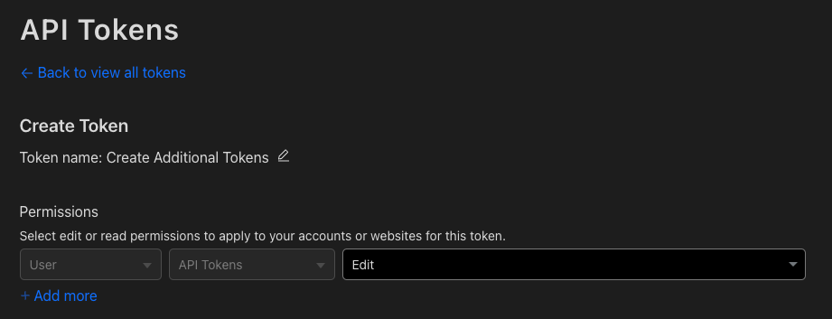

If you're using the [Cloudflare Terraform Provider](https://registry.terraform.io/providers/cloudflare/cloudflare/latest), I've got some tips and insights to help make your life easier. I'll be covering everything from creating tokens to managing Zones and handling Rulesets and Page Rules.

# Tokens

Over the years, Cloudflare has expanded its offerings, they now have a wide variety of services. The various services should each have their own token, all created from this [manually created](https://developers.cloudflare.com/fundamentals/api/get-started/create-token/), I shall call it, “bootstrap” token, but you want to manage even the permissions of that token, so how do you import it?

To update the permissions of the other tokens, Terraform, and in that extent the token you are using, needs to have the permissions to read the permissions groups, which you access via

```hcl
data "cloudflare_api_token_permission_groups" "all" {}
```

When testing this out locally, you would probably decide to generate a “Real all resources” token from the UI in Cloudflare… When I ran a `terraform plan`, I was confused as to why it didn’t work for me, even when creating a temporary token with all permissions enabled in Cloudflare

```bash
╷
│ Error: error listing API Token Permission Groups: Unauthorized to access requested resource (9109)
│
│   with data.cloudflare_api_token_permission_groups.all,
│   on tokens.tf line 1, in data "cloudflare_api_token_permission_groups" "all":
│    1: data "cloudflare_api_token_permission_groups" "all" {}
│
╵

```

So, I decided to try and list the tokens directly via the API. That also didn’t work

```bash
❯ curl -sX GET "https://api.cloudflare.com/client/v4/user/tokens/permission_groups" \
     -H "Authorization: Bearer xxxxxx" | jq .
{
  "success": false,
  "errors": [
    {
      "code": 9109,
      "message": "Invalid access token"
    }
  ],
  "messages": [],
  "result": null
}

```

It took me a while to realize that by the looks of it ([mentioned nowhere in their documentation](https://developers.cloudflare.com/fundamentals/api/get-started/create-token/)) you can only have one permission of `User → API Tokens` to read the token permissions.

**“Read all resources” does not grant you this permission!**



Once I used the above temporary token to get the ID of the bootstrap token, I could import it.

```bash
❯ terraform import cloudflare_api_token.bootstrap ictbnep0r9gy7udjx4throbx9cz212r3

Import successful!

The resources that were imported are shown above. These resources are now in
your Terraform state and will henceforth be managed by Terraform.

```

---

As resources are added, permissions have to be expanded to support creating those resources.

The token permissions are expanded via the special “bootstrap” token that has the required permissions to make the changes to other tokens.

As for the permissions categories, they can be viewed on the [API token permissions](https://developers.cloudflare.com/fundamentals/api/reference/permissions) page (note that "Edit" should be replaced with "Write" in TF).

Again, if you want to view the permissions via the API, you will need to generate a temporary token with the `User → API Tokens` permission (only added when selecting the “Create Additional Tokens” Template).

An example to give Datadog Analytics Access

```hcl
resource "cloudflare_api_token" "analytics_token" {
  name = "staging_analytics_token"

  policy {
    permission_groups = [
      data.cloudflare_api_token_permission_groups.all.zone["Analytics Read"],
      data.cloudflare_api_token_permission_groups.all.zone["Zone Read"],
    ]
    resources = {
      "com.cloudflare.api.account.${var.account_id}" = jsonencode({
        "com.cloudflare.api.account.zone.${cloudflare_zone.staging_zone.id}" = "*"
      })
    }
  }

  condition {
    request_ip {
      in = jsondecode(data.http.datadog_ips.response_body).webhooks.prefixes_ipv4
    }
  }
}
```

Cloudflare allows us to lock a token to specific IPs, in the above example for [Datadog](https://docs.datadoghq.com/api/latest/ip-ranges), we are using the following

```json
data "http" "datadog_ips" {
  url = "https://ip-ranges.datadoghq.com"

  request_headers = {
    Accept = "application/json"
  }

  lifecycle {
    postcondition {
      condition     = contains([200], self.status_code)
      error_message = "Datadog IP List fetch failed"
    }
  }
}
```

# Zone

Due to a catch-22 related to the Tokens and Zones, the zones have been created manually and imported to Terraform.

I will be using a made up Zone ID of `9xwl8oagflf85yi7dls0wypsu4wwgkzk` in my examples, please change this to your [Zone ID](https://developers.cloudflare.com/fundamentals/get-started/basic-tasks/find-account-and-zone-ids/).

How to import a Zone? Resources can easily be imported with [cloudflare/cf-terraforming](https://github.com/cloudflare/cf-terraforming). For example, to import DNS Records, first [generate](https://github.com/cloudflare/cf-terraforming#example-usage)

```bash
cf-terraforming generate \
  --zone "9xwl8oagflf85yi7dls0wypsu4wwgkzk" \
  --resource-type "cloudflare_record"
```

This will spit out a `terraform import` command, below is an example for the initial [import](https://github.com/cloudflare/cf-terraforming#importing-with-terraform-state) of the zone. The command was modified slightly to change the resource names (by default the tool spits out randomized resources names to easily track the state)

```bash
cf-terraforming import \
  --resource-type "cloudflare_records" \
  --zone "9xwl8oagflf85yi7dls0wypsu4wwgkzk"
```

To apply this to a Zone

```bash
❯ terraform import cloudflare_zone.prod_zone 9xwl8oagflf85yi7dls0wypsu4wwgkzk

Import successful!

The resources that were imported are shown above. These resources are now in your Terraform state and will henceforth be managed by Terraform.
```

Any further adjustments to the Zone can be managed in TF.

# Rulesets

This is a summary from https://github.com/cloudflare/terraform-provider-cloudflare/issues/1811

There was a header order issue with the `cloudflare_ruleset`. If you have a configuration file such as the example below

```hcl
resource "cloudflare_ruleset" "remove_headers" {
  zone_id     = "zone_id"
  name        = "Transform rule for removing HTTP Headers"
  description = "Remove Headers before reaching client"
  kind        = "zone"
  phase       = "http_response_headers_transform"
	rules {
    action = "rewrite"action_parameters {
      headers {
        name      = "header1"
        operation = "remove"
      }
      headers {
        name      = "header2"
        operation = "remove"
      }
      headers {
        name      = "header3"
        operation = "remove"
      }
      headers {
        name      = "header4"
        operation = "remove"
      }
    }

    expression  = "true"
    description = "Remove Headers"
    enabled     = true
  }
}
```

It will always trigger a change

```bash
# cloudflare_ruleset.remove_headers will be updated in-place
  ~ resource "cloudflare_ruleset" "remove_headers" {
        id          = "ttuxrt3n2gzinq4yxssz7i6ohy7cw0ju"
        name        = "Transform rule to remove Headers"
        # (4 unchanged attributes hidden)

      ~ rules {
            id          = "lm4ldin644x41l9dw80o63c3imu6e5jj"
            # (4 unchanged attributes hidden)

          ~ action_parameters {
                # (11 unchanged attributes hidden)

              ~ headers {
                  ~ name      = "header4" -> "header1"
                    # (1 unchanged attribute hidden)
                }
              ~ headers {
                  ~ name      = "header1" -> "header2"
                    # (1 unchanged attribute hidden)
                }
              ~ headers {
                  ~ name      = "header3" -> "header4"
                    # (1 unchanged attribute hidden)
                }
                # (1 unchanged block hidden)
            }
        }
    }

Plan: 0 to add, 1 to change, 0 to destroy.
```

```bash
cloudflare_ruleset.remove_headers: Modifying... [id=ttuxrt3n2gzinq4yxssz7i6ohy7cw0ju]
cloudflare_ruleset.remove_headers: Modifications complete after 0s [id=ttuxrt3n2gzinq4yxssz7i6ohy7cw0ju]

Apply complete! Resources: 0 added, 1 changed, 0 destroyed
```

The issue was that the items are applied alphabetically. The order in terraform has to reflect this, or the `terraform plan` will show changes every time and the `terraform apply` will attempt to apply it every time.

Sadly, I wasn’t able to share the exact header names, so the above example actually won’t cause a change.

---

On another ruleset suggestion, when creating multiple rulesets via TF when they run on the same phase you can't define them as individual blocks. You have to create a single ruleset with multiple entry points.

While the CF UI makes it appear that you are creating multiple separate rulesets, it's apparently managing all of that under the hood and the TF docs don't really call that out.

Took a while to find the answer in the [Cloudflare Community Forum](https://community.cloudflare.com/t/multiple-cloudflare-rulesets-deployment-via-terraform/444120), [GitHub](https://github.com/cloudflare/terraform-provider-cloudflare/pull/1393) and their [Documentation](https://developers.cloudflare.com/ruleset-engine/about/phases/).

If you implemented it the wrong way initially, this will cause a replacement!

# Page Rules

Why on Earth is the priority for a [cloudflare_page_rule](https://registry.terraform.io/providers/cloudflare/cloudflare/latest/docs/resources/page_rule) in Terraform, opposite of what it is in the UI?

Don’t get me wrong, the Terraform (and API) way makes sense, the higher the number, the higher the priority, but in the UI this is inverted…

# Conclusion

In conclusion, these tips and insights should help make using the Cloudflare Terraform provider easier and more effective. With these tips, you can streamline your workflow and get the most out of your Cloudflare Terraform integration. However, keep in mind that these tips are just suggestions and may not work for every use case, so always be sure to thoroughly test and explore your options.
