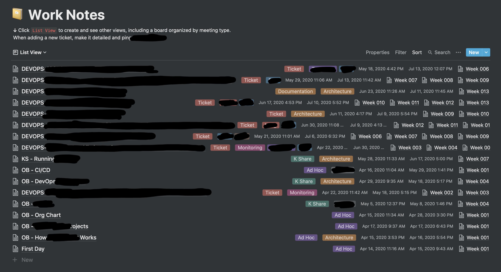
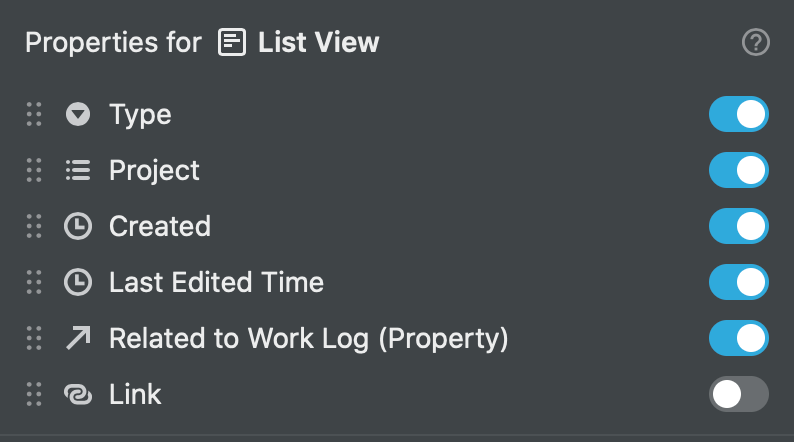
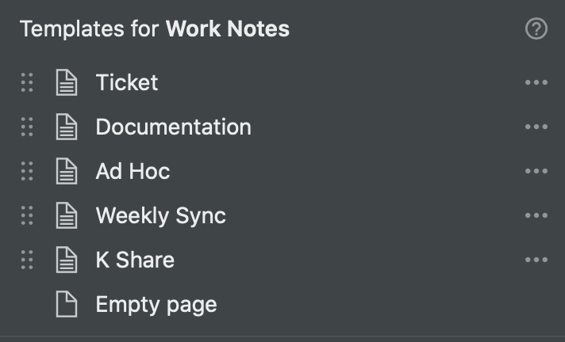
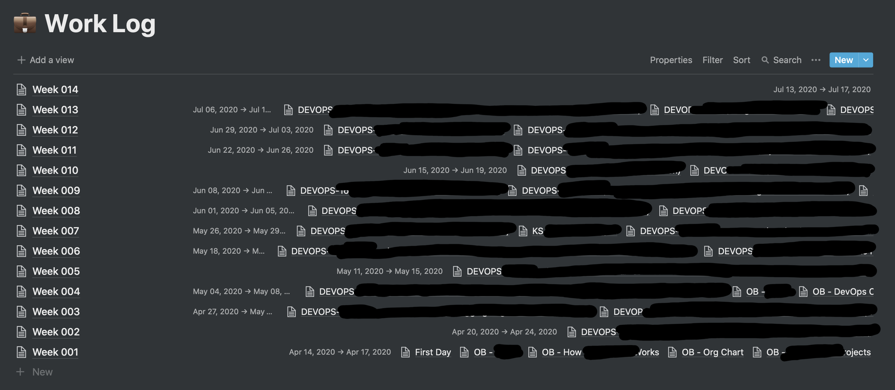
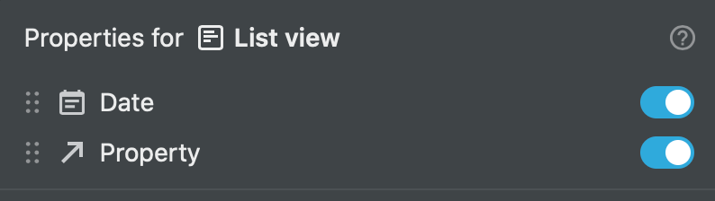
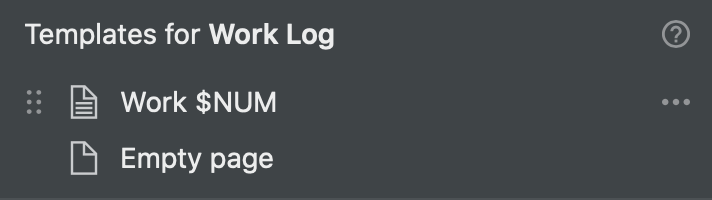

# Requirements

As a DevOps Engineer, I had a problem I was looking to solve for a long time.

How to do productive work (be in the zone), take useful notes without getting distracted and transfer them in a readable way in a ticket tracking system like Jira.

A system was needed.

# Investigation

I played around with various tools in the past, here are just some of the things I tried:

- Plain Text Files
- Jupiter Notebooks
- Self Hosted Wiki
- Physical Notebooks
- Evernote

Some of them didn't work, some of them worked for a while, but none of them worked as well as [Notion](http://notion.so/).

So, here is my Notion work setup. This won't apply to everyone as the requirements are different for everyone.

You don't have to be DevOps to use this system, it can also be applied to other roles, anything that relates to inputting formatted text and code into a website like Jira.

# Solution

This system treats **tickets** are the source of truth. No task should be completed without a ticket, this is why everything references tickets and the main notes are kept in the tickets.

There are 2 main sections:

- Notes
- Log

## Notes

This is where you will be 90% of the time.



Apologies for the truncation, you understand.

- Properties

    

- Templates

    


Ticket Template

```markdown
# Information

## Meeting (template button)

Participants: <name>,

## Catchup (template button)

Participants: <name>,

Agenda:

-

Todo:

- [ ]

---

## Related

<link to page>

# Comments

# Tasks

- [ ]
```

As for the other templates, I think they are pretty self-explanatory, so I won't be putting them here.

When I start working on a new ticket, I fill in any information required for that ticket in the `# Information` section.

`## Meeting` and `## Catchup` are [template buttons](https://www.notion.so/5c033c12ac3b4c1fb4703491be74550d?pvs=21) which are only added if there is a related Meeting or Catchup related to the ticket.

`## Related` section is for any related tickets, linked as Notion page links if formerly worked on, or normal links if they are not in Notion.

`# Comments` section is where it gets interesting. Each block within, separated by `--` is a comment on the ticket. These initially start out as a collection of scattered bullet points, code blocks, links and whatever else that is related to the current work being done.
End of day or when a block of work is done I go over the notes, make them readable and pretty before copying the section and pasting it as is to Jira, which now fully supports Markdown.
The only issue I have found so far is that I can't paste images that have been added to notion... so I usually wait until the ticket is added to Jira before adding the image to both Jira and Notion, not a huge problem but indeed a small annoyance.

`# Tasks` is where all the action items related to the current ticket sit. This is an ever-evolving section with actions constantly being added, removed and edited as the work progresses.
I typically keep this section cloned and synced to the ticket's description in Jira. If a ticket becomes to big, as can happen with a lot of investigation tickets, a section can be broken off into subtasks.

## Log

The remaining 10%.



Again, apologies for the truncation, you understand.

Properties. `Property` points to a Note property (as can be seen in the above image).



Templates. `$NUM` is replaced by the week number (tracked since I started working at the company).



Week Template

```markdown
### Monday

>
-

### Tuesday

>
-

### Wednesday

>
-

### Thursday

>
-

### Friday

>
-

---

### Weekend

- [ ]
-
```

This is where the "logs" live. It shows me what work was done on a given day (useful for stand-ups and progress updates) and what is coming up regarding scheduled tickets and tasks.

Tasks part of a ticket are typically copy-pasted from the `# Tasks` section under a ticket note.

At the beginning of each day I take a look at the work that is scheduled to be completed that day and at the end of the day, I make note of the work that was actually completed.

# Conclusion

This is only one part of my whole workflow.

I use a multitude of other tools as well as the [Notion Web Clipper](https://www.notion.so/ba54b19ecaeb466b8070b9e683c5fce1?pvs=21) extensively, mainly for bookmarks.

I will **not** be posting a Notion template as I find them pretty useless. Coping something someone else made doesn't make you think and understand how the system should look like. Ideally, you would take the concepts of the system I use (if you agree with it) and create something that works best for you.

Thanks for taking the time to read.

Stay safe and have a great day!
