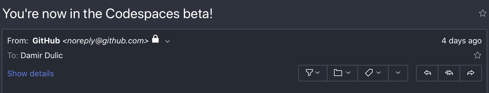
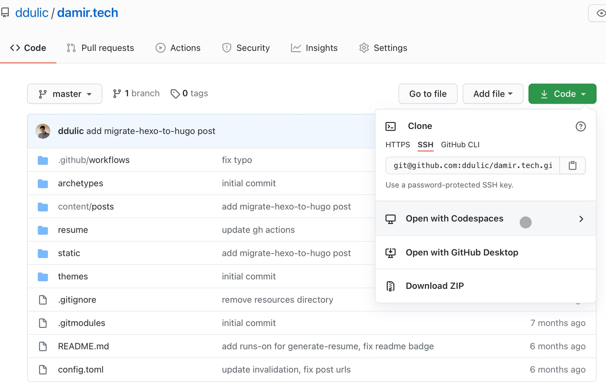
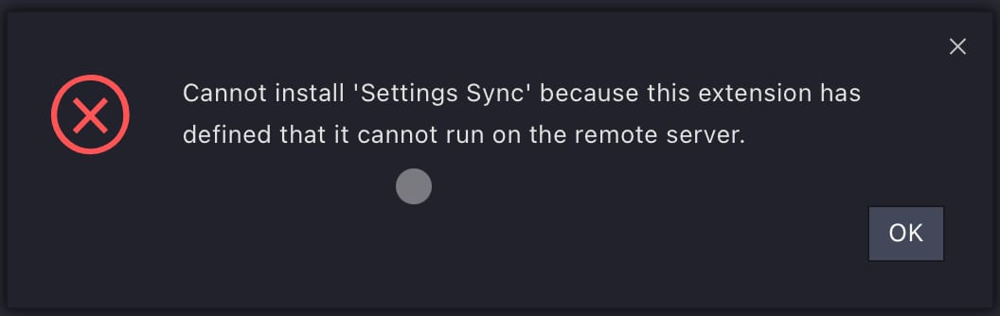

# Introduction

In this post, I will investigate if it is possible to use the iPad Pro for "coding" with GitHub Codespaces.

I have an iPad Pro 2020 12.9" and it is a wonderful tool, the fluent 120hz display makes reading, watching videos (although most are locked at 30), and even navigating the UI pure joy. The only thing I was missing was being able to code and publish [my website](https://devblogs.microsoft.com/visualstudio/introducing-visual-studio-codespaces/) with it.



As of writing this, [GitHub Codespaces](https://github.com/features/codespaces) is in Early Access and I was lucky enough to have been given access.

For context, I use VSCode as my default editor for almost everything, so Codespaces feels mostly at home.

I also use the Magic Keyboard, but you can use any keyboard and mouse.

# Before Codespaces


You might have noticed the quotes around coding in the first sentence, this is because I don't code that much outside of work, I mostly have this blog which I occasionally play with. The only requirement for a coding environment for me is `git` and some way to edit files in a repository.

Sadly, I cannot test for my 9-5 as Codespaces is enabled per user or org.

What have I tried before Codespaces? Well, as most people who Google on how you can code on the iPad, I ended up getting [Textastic](https://www.textasticapp.com) as a code editor and [Working Copy](https://workingcopyapp.com) for git. Why didn't this work? Working Copy wants me to pay for using `git push`, I don't remember the exact price, and that didn’t feel like a full solution for me as I also needed a way to run different CLI tools.

I tried using a Linux Cloud VM, but with this, I am limited to no GUI. I also found a number of videos online of people ssh-ing into the [RPI](https://www.raspberrypi.org) and coding that way, but I didn't feel like trying this out (even though my RPI3b is sitting in a box somewhere).

Continuing my research, I stumbled upon [code-server](https://github.com/cdr/code-server) and the many commercial offerings that seem to come from it. I wanted to avoid self-hosting as I couldn't be bothered to manage it (are you picking up a trend here?) and most of the commercial solutions, of which I tried two, were rubbish. Most required a flat monthly fee and were too expensive for what they offered (I don't require collaboration, which is required and charged with most solutions).

All of the above seemed like hacks to what should be a "native" experience.

I don't know why Apple doesn't fix coding on the iPad, but maybe they didn't even care as a better solution has been in the making.

# After Codespaces



Browsers are becoming the new OS, you can do a lot in a browser, if you can play [AAA games](https://en.wikipedia.org/wiki/AAA_%28video_game_industry%29) why wouldn't you be able to code?

Pricing is fair and Codespaces will be available to all users - [About billing for Codespaces](https://docs.github.com/en/free-pro-team@latest/github/developing-online-with-codespaces/about-billing-for-codespaces).

Launching it couldn’t be simpler, as it is built into GitHub. Once you have access to Codespaces, you get an extra option when you press on the “Code” button in a valid repository - “Open with Codespaces”

Here you can launch a new Codespace or re-use a previous one that is most likely paused.

It will take a few seconds to boot up, once it does, you are in a full VSCode Cloud Environment 🎉

So, let’s try and configure it. Luckily, I use the popular [Settings Sync](https://marketplace.visualstudio.com/items?itemName=Shan.code-settings-sync) extension to sync settings up to GitHub, so all I need to do is grab that extension and...

FFS...



Poking around in the settings shows that it has some sort of sync, however, seems to be a preview feature - [https://code.visualstudio.com/docs/editor/settings-sync](https://code.visualstudio.com/docs/editor/settings-sync)

After turning it on in my main VSCode... most of the things worked, I didn’t expect this to be the case, the only thing that I couldn’t get working was my font of choice - Fira Code.

Given that the environment is just a Debian Docker image, we can configure it while we are in it with the built-in VSCode Terminal, or we can even go much deeper with a `devcontainer.json` file which we would place in the root of our project. You can find the container configuration documentation [here](https://github.com/MicrosoftDocs/vscodespaces/blob/live/vs-online/reference/configuring.md).

```bash
codespace:~/workspace/damir.tech$ cat /etc/os-release
PRETTY_NAME="Debian GNU/Linux 9 (stretch)"
NAME="Debian GNU/Linux"
VERSION_ID="9"
VERSION="9 (stretch)"
VERSION_CODENAME=stretch
ID=debian
HOME_URL="https://www.debian.org/"
SUPPORT_URL="https://www.debian.org/support"
BUG_REPORT_URL="https://bugs.debian.org/"
```

The state is kept until the container is destroyed, and I am not certain how much time needs to pass for this to happen, it is probably documented somewhere but I CBA to search for it, which is why you won’t find a Codespaces config file in my repo, at least for now. I can see this being a requirement for larger projects.

All of that is nice and all, but how it works, well, it turns out that it works “well enough”, that is, it allows me to do what I need to do that I couldn’t have done previously. It isn’t the best experience it in the world, but it works.

The last two posts have been mostly published via GitHub Codespaces, working from my iPad. I say mostly because I use Notion on the iPad to write up the drafts, however, [copy and paste is broken](https://twitter.com/_ddulic/status/1328272880711430144) in their iPad app...

For this repository ([ddulic/damir.tech](https://github.com/ddulic/damir.tech)) I just needed a few tools to get me up and running...

I required [Hugo](https://gohugo.io/), and the simplest way to install Hugo is with [brew](https://brew.sh).

After that was done, I needed to see if the `hugo server -w` would work, which starts a local server, so you can see your changes in real-time as you introduce changes to your post locally.

But doing just `hugo server -w` didn’t work in a virtual environment like this, if we take a look at the `env` we will see a nifty env variable by the name of `CLOUDENV_ENVIRONMENT_ID` this will allow us to construct a URL that Hugo will find appealing

```bash
hugo server --baseURL https://${CLOUDENV_ENVIRONMENT_ID}-1313.apps.codespaces.githubusercontent.com --appendPort=false
```

The [Hugo Helper](https://marketplace.visualstudio.com/items?itemName=rusnasonov.vscode-hugo) extension was ported with my settings, and it worked like a charm.

Everything else is the same, I use `git` in the terminal and everything gets pulled in automatically from GitHub.

It does NOT pull changes automatically, you still need to do a manual `git pull` if you make changes outside Codespaces.

# Conclusion

:::note
TLDR: Codespaces ain’t there yet (at least for the iPad), but there is huge potential
:::

Codespaces has its issues (it is still in early access for a reason) and it will be years before it can replace a native desktop experience. For now, it is for the people who just need to code “a bit” and don’t do it full-time.

Here are some of the issues that I noted down:

- Takes 30-120s to start, sometimes longer
- Leaving it open at the end of the day, only to return to it the next day and have the tab hang occasionally, refresh doesn’t work, you have to go back to the repo and relaunch it from there
- The obvious - you need to be online
- Occasionally, disconnects
- I am not certain how to handle [commit signatures](https://github.community/t/github-codespaces-should-gpg-sign-commits/137011) (possibly a future post)

I will still use it whenever I must code out of work, as I am stubborn and have to validate that I do everything on an iPad.

---

Liked the post? Interested in more? Follow me on [LinkedIn](https://www.linkedin.com/in/ddulic/).

Stay safe!

