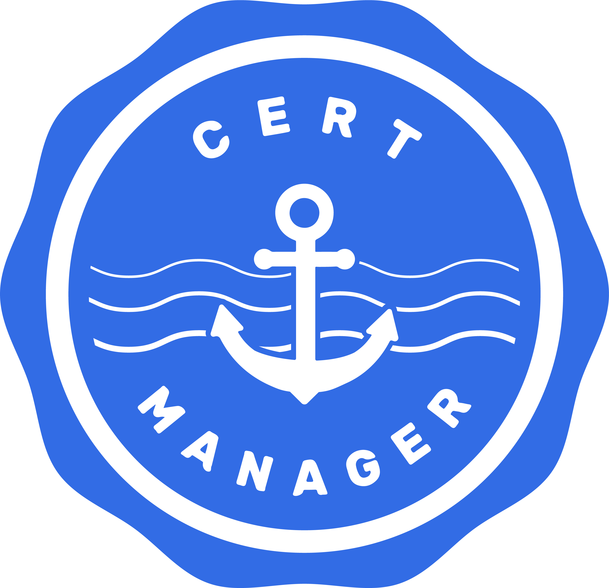

I wanted to put out a quick guide on how to get the Kong Validating Admission Controller (VAC) working with cert-manager.

For those who don’t know, Kong can be deployed as an Ingress Controller on Kubernetes, which means that as applications are deployed and new services are created, Kong will automatically configure itself to serve traffic to these services. This also allows us to configure services within Kong using k8s manifests. Pretty neat.

The Kong Ingress Controller ships with an Admission Controller for KongPlugin and KongConsumer resources in the configuration.konghq.com API group. An Admission Controller is a piece of code that intercepts requests to the Kubernetes API server before persistence of the object, but after the request is authenticated and authorized.

---

This post is also posted on the WorldRemit Technology Blog below

[Kong Validating Admission Controller Webhook with cert-manager](https://technology.worldremit.com/kong-validating-admission-controller-webhook-with-cert-manager/)

---

Let's setup the VAC Webhook with Kong. A quick search reveals Kong has instructions on how to do this

[Open-Source API Management and Microservice Management](https://docs.konghq.com/kubernetes-ingress-controller/1.1.x/deployment/admission-webhook/)

"The Admission Controller needs a TLS certificate and key pair, which you need to generate as part of the deployment."

The above documentation is a good start, however, Kong only provides us with certificate instructions on how to either:

- Manually generate the certificate, which is fine for testing and playing with the VAC, but this is 2021... please don’t use this method for Production...
- Use the built-in [Kubernetes CA](https://kubernetes.io/docs/tasks/tls/managing-tls-in-a-cluster/), using the k8s CA allows us to skip most of the commands from the manual step, but we still need to manually approve the certificates... still not good enough...

None of the above provides us with a solid solution for renewals, and if your cert is bad, all requests that have anything to do with the `apiGroup` attached to the `ValidatingWebhookConfiguration` will fail 😭

In comes [cert-manager](https://cert-manager.io), the automation-friendly solution. What does it do? Cert Manager is a Kubernetes add-on to automate the management and issuance of TLS certificates from various issuing sources.

I will skip the installation section and assume you have cert-manager installed and correctly set up in your cluster.

With all of that out of the way, let’s get Kong to work properly with cert-manager.



Poking around at the cert-manager docs, we can quickly come up with the yaml required to generate a self-signed certificate request.

```yaml
---
apiVersion: cert-manager.io/v1
kind: Issuer
metadata:
  name: selfsigned-issuer
spec:
  selfSigned: {}
---
apiVersion: cert-manager.io/v1
kind: Certificate
metadata:
  name: kong-validation-webhook
spec:
  commonName: kong-validation-webhook.kong.svc
  dnsNames:
    - kong-validation-webhook.kong.svc.cluster.local
    - kong-validation-webhook.kong.svc
  issuerRef:
    kind: Issuer
    name: selfsigned-issuer
  secretName: kong-validation-webhook
  duration: 8760h # 1y
  renewBefore: 730h # 1m
```

cert-manager issues certificates with a default duration of 90 days, which would normally be fine, but as we will see later, there is an issue with Kong when it comes to updating the cert files, so we are setting this to 1 year, the default for anything that communicates with the API in k8s - [https://kubernetes.io/docs/tasks/tls/certificate-rotation/#overview](https://kubernetes.io/docs/tasks/tls/certificate-rotation/#overview)

Once the above is applied to the cluster, you will see a new secret name in your Kong namespace with the name of `kong-validation-webhook`

Before we configure the actual webhook, we need to modify the Kong Ingress Controller and add the following yaml to our Controller deployment

```yaml
- name: CONTROLLER_ADMISSION_WEBHOOK_LISTEN
  value: ":8080"
volumeMounts:
  - mountPath: /admission-webhook
    name: validation-webhook
volumes:
  - name: validation-webhook
    secret:
      secretName: kong-validation-webhook
```

Or just [patch it directly](https://docs.konghq.com/kubernetes-ingress-controller/1.1.x/deployment/admission-webhook/#update-the-deployment)

```bash
kubectl patch deploy -n kong ingress-kong \
    -p '{"spec":{"template":{"spec":{"containers":[{"name":"ingress-controller","env":[{"name":"CONTROLLER_ADMISSION_WEBHOOK_LISTEN","value":":8080"}],"volumeMounts":[{"name":"validation-webhook","mountPath":"/admission-webhook"}]}],"volumes":[{"secret":{"secretName":"kong-validation-webhook"},"name":"validation-webhook"}]}}}}'
deployment.extensions/ingress-kong patched
```

Once the secret is created and the deployment updated, we can issue the actual webhook

```yaml
# https://github.com/Kong/kubernetes-ingress-controller/blob/1.0.x/deploy/manifests/validation-webhook-configuration.yaml
---
apiVersion: admissionregistration.k8s.io/v1beta1
kind: ValidatingWebhookConfiguration
metadata:
  name: kong-validations
  annotations:
    cert-manager.io/inject-ca-from: kong/kong-validation-webhook
webhooks:
  - name: validations.kong.konghq.com
    failurePolicy: Fail
    sideEffects: None
    admissionReviewVersions: ["v1beta1", "v1"]
    rules:
      - apiGroups:
          - configuration.konghq.com
        apiVersions:
          - "*"
        operations:
          - CREATE
          - UPDATE
        resources:
          - kongconsumers
          - kongplugins
      - apiGroups:
          - ""
        apiVersions:
          - "v1"
        operations:
          - CREATE
          - UPDATE
        resources:
          - secrets
    clientConfig:
      service:
        name: kong-validation-webhook
        namespace: kong
      # caBundle: Cg==
```

Note that we do not need the `caBundle` as we are generating it with cert-manager.

:::warning
Make sure you deploy the ValidatingWebhookConfiguration after the certificate has been generated and deployment updated. If you deploy the VAC first, any deploy that is relatable to the resources listed above will fail, maybe even others, due to the certificate miss-match.
:::


```
Error from server (InternalError): error when creating "STDIN": Internal error occurred: failed calling webhook "validations.kong.konghq.com": Post https://kong-validation-webhook.kong.svc:443/?timeout=30s: x509: certificate signed by unknown authority (possibly because of "x509: invalid signature: parent certificate cannot sign this kind of certificate" while trying to verify candidate authority certificate "kong-validation-webhook.kong.svc")
```

If you completed all the steps above, you will now have the Webhook configured, if you do a test deploy of a KongPlugin you will see it fail 😻

```bash
❯ echo "
apiVersion: configuration.konghq.com/v1
kind: KongPlugin
metadata:
  name: request-id
config:
  foo: bar
  header_name: my-request-id
plugin: correlation-id
" | aws-okta exec wr-login.devops -- kubectl apply -f -
Error from server: error when creating "STDIN": admission webhook "validations.kong.konghq.com" denied the request: 400 Bad Request {"fields":{"config":{"foo":"unknown field"}},"name":"schema violation","code":2,"message":"schema violation (config.foo: unknown field)"}
exit status 1
```


You will be forgiven if you think that is it, but there is a lurking issue that will make itself visible in a couple of months, the certificate renew will fail as Kong won't pick up the updated certificate on disk without a redeployment, and until you redeploy you will most likely see the same error from before.

The "workaround" for this is to set a long duration on the cert (this is the `duration` and `renewBefore` in the cert-manager certificate request yaml). Not ideal from a security perspective but I wasn't aware of a better tmp solution to the problem 😢

I opened a bug report with Kong, they are aware of the "issue", for more info see the report below

[Ingress Controller not checking for updated webhook certificates · Issue #986 · Kong/kubernetes-ingress-controller](https://github.com/Kong/kubernetes-ingress-controller/issues/986)

Thanks for taking the time to read! Hopefully, this short guide will help you setup Kong VAC Webhook with cert-manager and allow you to better manage certificates. We should always strive to squash manual processes when configuring production-ready workloads.

---

Liked the post? Interested in more? Follow me on [LinkedIn](https://www.linkedin.com/in/ddulic/)

Have a lovely day and stay safe!
