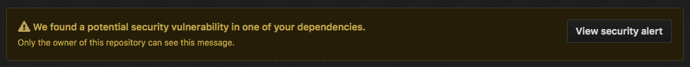

# Introduction

Recently, I have been playing around with golang and because I am bored, at home, and quarantined, so I decided why not migrate my website from Hexo to Hugo.

There are a few reasons why I decided to make the leap:

- golang, the language Hugo is written in, is cleaner and stricter, especially compared to Node
- Easier updates. I forget how to update the website every single time, Hexo updates are too complicated, I spend 1-2h every time configuring all the changes
- Hugo offers better code block support and syntax highlighting (it even supports Nginx and systemd)
- I am sick of Node security updates. Every other week, there is some new security vulnerability

    

- I have wanted to do a rewrite to my original [website](https://damir.tech/2018-website-continuous-deployment-pipeline/) and [resume](https://damir.tech/2018-resume-continuous-deployment-pipeline/) CI/CD approach. The original implementation worked like a dream but always felt a bit too hacky.
- I wanted to experiment more with golang and having my website in go would force me to do so

As with everything in life, there are pros and cons, and I am losing the wonderful animations brought by Hexo and [hexo-theme-next](https://github.com/theme-next/hexo-theme-next).

# Setup

This won't be a long and detailed post, I just want to share some of my findings in the hope of it helping someone who wishes to do the same migration.

Both Hexo and Hugo are markdown, even though they have similar configuration at first look, it is **NOT** the same.

**Note** - current version of Hugo as of writing this is

```bash
codespace:~/workspace/damir.tech$ hugo version
Hugo Static Site Generator v0.76.2/extended darwin/amd64
```

Below are all the commands you will need to run to work with Hugo:

```bash
codespace:~/workspace/damir.tech$ history | grep hugo
brew install hugo # installs hugo
hugo new site damir.tech # initializes a new website
hugo # generates the static files
hugo version # do I really need to explain this?
hugo server -w # starts a server locally
```

## Theme

First thing is first, we have to pick a theme, just as we had to do with Hexo.

My theme of choice is [Hermit | Hugo Themes](https://themes.gohugo.io/hermit/)

Adding a theme is usually straightforward, just clone the theme repo into your Hugo installation, in my case it was

```bash
git clone https://github.com/Track3/hermit.git themes/hermit
```

Tip: If you are going to keep your website in a git repo as I do, you can add your theme as a submodule

```bash
git submodule add https://github.com/Track3/hermit.git themes/hermit # to initially add the submodule
git submodule update --init --recursive # use in the future when cloning/checking out the repo
```

And that is it, if you now go to the root folder of your site (make sure you ran `hugo init` first!) and run `hugo server -w` you should be able to see your site (with the default posts and configuration) running on `localhost:1313`.

Useful Hugo and theme shortcodes going forward, some are highly related to the theme I chose

- [https://gohugo.io/content-management/shortcodes/](https://gohugo.io/content-management/shortcodes/)
- [https://hugo-theme-hermit.netlify.com/posts/typography/](https://hugo-theme-hermit.netlify.com/posts/typography/)
- [https://hugo-theme-hermit.netlify.com/posts/the-figure-shortcode/](https://hugo-theme-hermit.netlify.com/posts/the-figure-shortcode/)
- [https://hugo-theme-hermit.netlify.com/posts/post-with-featured-image/](https://hugo-theme-hermit.netlify.com/posts/post-with-featured-image/)

## Posts

Modifications can be minimal as they both share just about the same post "config" that is located at the top of the `.md` file.

Static content will have to be moved from `source` to `static`.

### Post Header

Hexo is fine with single tags in the same line, like

```
---
title: New OS Setup ft. Elementary OS 🐧
date: 2017-01-08 15:42:35
tags: linux
---
```

But Hugo doesn't like that... move the tag values to a new line like so

```
---
title: New OS Setup ft. Elementary OS 🐧
date: 2017-01-08 15:42:35
tags:
 - linux
---
```

### Post URL's

Make sure to update your post URLs, so your pages don't break.

The default for Hugo is `/posts/title`, which doesn't work for me as I have always kept to `/title`, so I have to update my `config.toml` with

```
[permalinks]
 posts = "/:title"
```

Hugo URL Management Docs: [https://gohugo.io/content-management/urls/](https://gohugo.io/content-management/urls/)

I also used this situation to clean up some of my old posts, check if they are up-to-date and remove old unused images.

### Custom CSS

I have some custom CSS that I always add to my pages (nothing is perfect out of the box).

This section will depend on the theme. For my theme, it was straightforward ([https://github.com/Track3/hermit](https://github.com/Track3/hermit))

- Modify CustomCSS in the config file and add the CSS file ref
- Add CSS to correct folder under `/static/css`
- If using Hugo > 0.60 you will need to add the below to your config file or else the HTML won't be picked up - [https://gohugo.io/news/0.60.0-relnotes/](https://gohugo.io/news/0.60.0-relnotes/)

```
[markup.goldmark.renderer]
 unsafe = true
```

## GitHub Actions

Travis has been replaced in favour of GitHub Actions. Should be self-explanatory if you look at the [config](https://github.com/ddulic/damir.tech/blob/master/.github/workflows/setup-website.yaml).

It utilizes [https://github.com/peaceiris/actions-hugo](https://github.com/peaceiris/actions-hugo).

# Conclusion

All in all, it took less than a day to migrate everything over to Hugo.

I didn’t do a speed test on Hexo, but Hugo scores 100 for Desktop and 99 for mobile on [PageSpeed Insights](https://developers.google.com/speed/pagespeed/insights), not too shabby.

One noticeable change is that the website feels a lot snappier, but this could also just be since there are fewer animations, and they are faster.

Have a productive day, stay safe!
