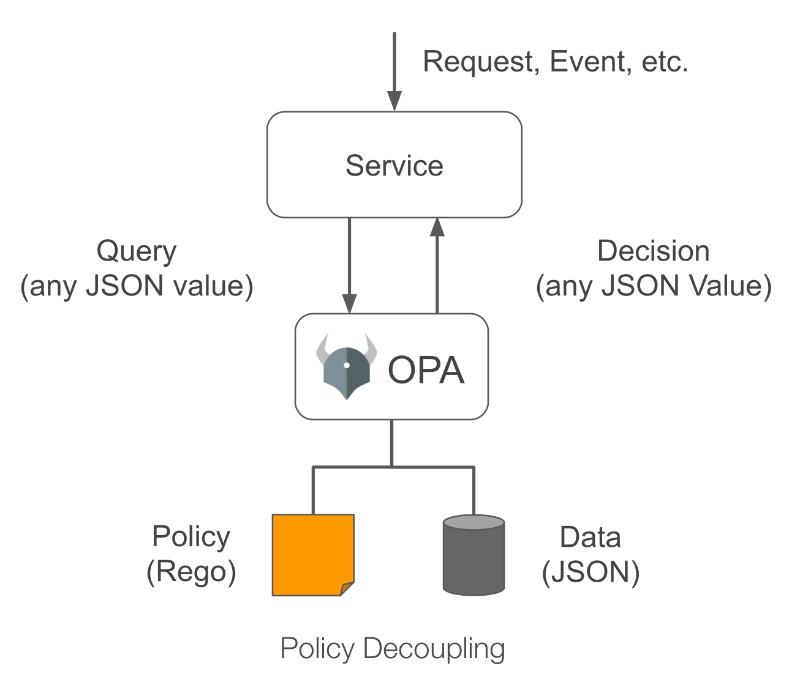
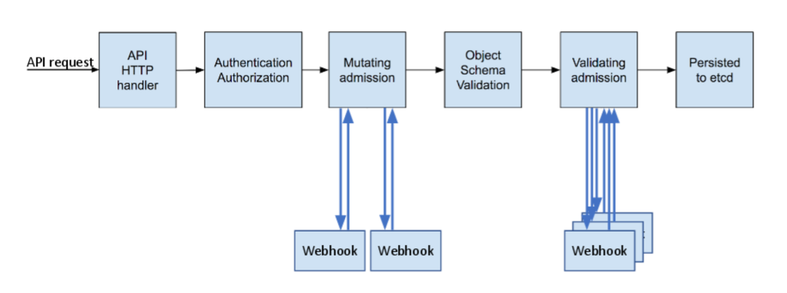

# Introduction

Modern-day systems are complex, they have numerous components and many moving parts within those components. To rationalize this complexity and protect a healthy system state, engineers or architects can choose to apply policies to individual components or whole systems.

To achieve this, we have to first know what a policy is. If we look at Wikipedia, a [policy](https://en.wikipedia.org/wiki/Policy) is a deliberate system of principles to guide decisions and achieve rational outcomes.

Applied to a microservice architecture, policies can be in the form of trusted services, rate-limits, user access, API scopes, etc.

These policies are often hard-coded in different parts of the stack, in many programming languages, have a different way of updating and are owned by different parts of the company.

This seems like a mess, doesn't it? Well, that is because it is, and the Open Policy Agent attempts to clean it up.

---

This article is also posted at the WorldRemit Technology Blog below

[Open Policy Agent at WorldRemit](https://technology.worldremit.com/open-policy-agent-at-worldremit/)

# What is the Open Policy Agent?

The [Open Policy Agent](https://www.openpolicyagent.org/) (typically seen as OPA (not [that opa](https://en.wikipedia.org/wiki/Opa_(Greek_expression)))) is an open-source, general-purpose policy engine that enables unified, context-aware policy enforcement across the entire stack.

OPA will keep the policies consistent across our system, all while being fast, μs (microsecond) fast!

It is used by many big names in tech such as Netflix, Chef, Atlassian, Cloudflare, Pinterest, Goldman Sachs, etc.

# How does it work?

At its core, the principle is simple, we have a policy decision that needs to be made, we just query OPA by passing in a structured query as input (JSON), which it will check against the Data (JSON) and Policy (Rego) and give us back a decision (JSON).

There are 4 main topics I want to cover to better understand OPA:

- Data
- Policy
- Query
- Decision



**Data**

Data must be provided to OPA in JSON, and it is cached in memory.

OPA doesn't have rules on the structure of the data, as well as input and output. The recommendation is to structure it in such a way that makes it easy for us to write policy rules against it.

Example of *Data* that OPA will use to make *Policy* decisions

```json
{
  "alice": [
    "read",
    "write"
  ],
  "bob": [
    "read"
  ]
}
```

**Policy**
OPA policies are expressed in a high-level declarative language called Rego.

Example of a Rego *Policy* that is mapped to previously defined *Data*

```
package myapi.policy

import data.myapi.acl
import input

default allow = false

allow {
        access = acl[input.user]
        access[_] == input.access
}

whocan[user] {
        access = acl[user]
        access[_] == input.access
}
```

**Query & Decision**
This, just like Data, must be JSON. It will contain the values we want to check against.

In the below example we are asking if Alice has the permissions to write

```json
{
  "input": {
    "user": "alice",
    "operation": "write"
  }
}
```

The *Input* above goes to OPA which checks the *Policy* against the *Data* and gives us back a *Decision*

```json
{
  "result": true
}
```

Policy decisions are not limited to simply allow/deny answers. Like query inputs, policies can generate arbitrary structured data as output.

**Note that the application still has to implement the enforcement of these decisions.** If we ask OPA if `foo` can access `bar`, and the answer is no, our application should reply with a 403 Forbidden.

:::note
Want to play around with OPA and Rego? Take a look at their interactive online playground.
:::


# How can we use it?

There are several open-source projects that integrate with OPA to implement fine-grained access control. Some interests are SSH, Kong, Istio (Envoy), Kubernetes. For a comprehensive list, see [OPA Ecosystem](https://www.openpolicyagent.org/docs/latest/ecosystem).

We will focus on 2 DevOpsy use-cases as part of this post:

- Gatekeeper for Kubernetes
- Conftest for Configuration Files

## Gatekeeper

OPA can be leveraged in use cases beyond access control, [Gatekeeper](https://github.com/open-policy-agent/gatekeeper) allows us to have fine-grained policies for Kubernetes compute/network/storage resources, for example:

- Limit the use of unsafe images
- Block public image registries
- Disallow certain Egress traffic rules
- Require CPU & memory limits
- Prevent Ingress conflicts
- You get the picture 🖼️



Gatekeeper deploys OPA as an Admission Controller for Kubernetes. [Admission Controllers](https://kubernetes.io/docs/reference/access-authn-authz/admission-controllers) are plug-ins that intercept requests to the master API prior to persistence of a resource, but after the request is authenticated and authorized.

Gatekeeper makes it easy to write Admission Controllers, saving us a lot of hassle building and maintaining them. This is done by defining `ConstraintTemplates`, which describe both the Rego policy that enforces the constraint and the schema of the constraint.

**Example**
Once Gatekeeper is installed in the cluster, applying Gatekeeper/OPA policies is simple. The below example gives us the ability to require specific labels to be present before proceeding with the deployment.

Create the Constraint (CRD)

```yaml
apiVersion: templates.gatekeeper.sh/v1beta1
kind: ConstraintTemplate
metadata:
  name: k8srequiredlabels
spec:
  crd:
    spec:
      names:
        kind: K8sRequiredLabels
        listKind: K8sRequiredLabelsList
        plural: k8srequiredlabels
        singular: k8srequiredlabels
      validation:
        openAPIV3Schema:
          properties:
            labels:
              type: array
              items: string
  targets:
    - target: admission.k8s.gatekeeper.sh
      rego: |
        package k8srequiredlabels

        violation[{"msg": msg, "details": {"missing_labels": missing}}] {
          provided := {label | input.review.object.metadata.labels[label]}
          required := {label | label := input.parameters.labels[_]}
          missing := required - provided
          count(missing) > 0
          msg := sprintf("you must provide labels: %v", [missing])
        }
```

Specify required labels

```yaml
apiVersion: constraints.gatekeeper.sh/v1beta1
kind: K8sRequiredLabels
metadata:
  name: deploy-must-have-labels
spec:
  match:
    kinds:
      - apiGroups: [""]
        kinds: ["Deployment"]
  parameters:
    labels: ["app"]
```

Cool right? But what about previous deployments? Well, this is where the audit functionality comes in. It allows us to do periodic evaluations of replicated resources against the constraints enforced in the cluster to detect pre-existing miss-configurations. If we inspect the previously applied `K8sRequiredLabels` constraint and have violations we will see them under `violations` in the `status` field.

```yaml
apiVersion: constraints.gatekeeper.sh/v1beta1
kind: K8sRequiredLabels
metadata:
  name: deploy-must-have-labels
spec:
  match:
    kinds:
      - apiGroups: [""]
        kinds: ["Deployment"]
  parameters:
    labels: ["app"]
status:
  auditTimestamp: "2020-08-31T08:32:12Z"
  byPod:
  - enforced: true
    id: gatekeeper-controller-manager-0
  violations:
  - enforcementAction: deny
    kind: Deployment
    message: 'you must provide labels: {"app"}'
    name: service-foo
  - enforcementAction: deny
    kind: Deployment
    message: 'you must provide labels: {"app"}'
    name: service-bar
```

## Conftest

People overlook configuration files. But they are important, I would say, to the same extent as access policies.

Scanning configuration files, denying unsecure flags and options only meant for debugging could have prevented many ElasticSearch scandals ([1](https://www.wired.com/story/exactis-database-leak-340-million-records), [2](https://www.theguardian.com/technology/2019/aug/14/major-breach-found-in-biometrics-system-used-by-banks-uk-police-and-defence-firms), [3](https://www.dataviper.io/blog/2019/pdl-data-exposure-billion-people), etc).

[Conftest](https://www.conftest.dev/) allows us to do exactly that.

Conftest uses OPA to provide a user experience optimized for developers wanting to test all kinds of configuration files.

Now I know what you are thinking, how does this differ from Gatekeeper? Well, **Gatekeeper focuses on securing a Kubernetes cluster, and Conftest’s focus is earlier in the development process**. By virtue of them both using Open Policy Agent under the hood, the same policies can be used in both tools, making using them together a real end-to-end solution.

We could use Conftest to deny certain Docker images as part of CI/CD

```
package main

image_denylist = [
  "openjdk"
]

deny[msg] {
  input[i].Cmd == "from"
  val := input[i].Value
  contains(val[i], image_denylist[_])

  msg = sprintf("unallowed image found %s", [val])
}
```

But why not take it a step further and deny specific tools

```
package main

image_denylist = [
  "openjdk"
]

run_denylist = [
  "apk",
  "apt",
  "pip",
  "curl",
  "wget",
]

deny[msg] {
  input[i].Cmd == "from"
  val := input[i].Value
  contains(val[i], image_denylist[_])

  msg = sprintf("unallowed image found %s", [val])
}

deny[msg] {
  input[i].Cmd == "run"
  val := input[i].Value
  contains(val[_], run_denylist[_])

  msg = sprintf("unallowed commands found %s", [val])
}
```

```bash
❯ conftest test Dockerfile
FAIL - Dockerfile - unallowed image found ["openjdk:8-jdk-alpine"]
FAIL - Dockerfile - unallowed commands found ["apk add --no-cache python3 python3-dev build-base && pip3 install awscli==1.18.1"]

2 tests, 0 passed, 0 warnings, 2 failures, 0 exceptions
```

What about blocking `0.0.0.0` in Security Groups and `HTTP` on an ALB in Terraform

```
package main

has_field(obj, field) {
    obj[field]
}

deny[msg] {
    rule := input.resource.aws_security_group_rule[name]
    rule.type == "ingress"
    contains(rule.cidr_blocks[_], "0.0.0.0/0")
    msg = sprintf("ASG `%v` defines a fully open ingress", [name])
}

deny[msg] {
    proto := input.resource.aws_alb_listener[lb].protocol
    proto == "HTTP"
    msg = sprintf("ALB `%v` is using HTTP rather than HTTPS", [lb])
}
```

```bash
❯ conftest test main.tf
FAIL - main.tf - ASG `my-rule` defines a fully open ingress
FAIL - main.tf - ALB `my-alb-listener` is using HTTP rather than HTTPS

2 tests, 0 passed, 0 warnings, 2 failures, 0 exceptions
```


# Conclusion

This blog post was heavily inspired by several talks I attended (virtually) at KubeCon/CloudNativeCon Europe 2020 and you can find them on the official [CNCF](https://www.youtube.com/c/cloudnativefdn/videos) YouTube channel.

We have also just scratched the surface of what the Open Policy Agent is, and the tools built around it are capable of, and more are sure to come as it is rapidly growing in popularity.

Thanks for taking the time to read and stay safe!
