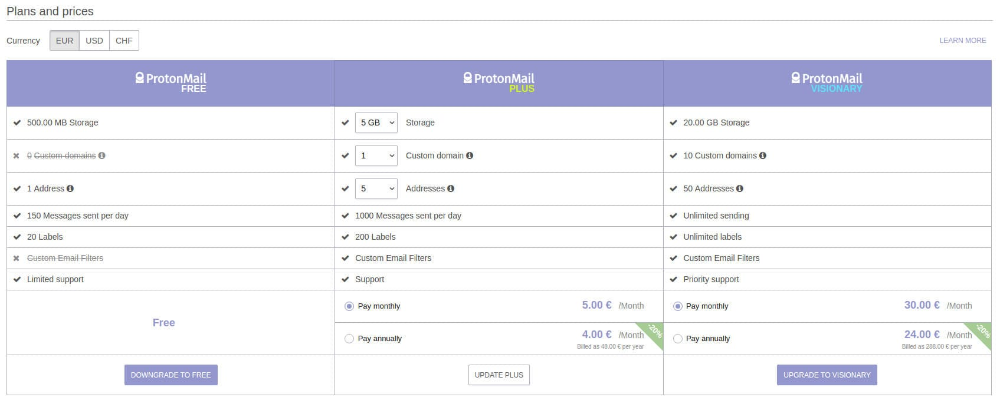

Let’s start all the way from the top, the master key to your whole digital life, the one thing every website wants. Your email. Everything goes through your email, so it must take top priority.

This is the first post in my [De-Google Guide](https://github.com/ddulic/damir.tech/blob/master/posts/de-google-guide) and I don’t know about you, but I am sick of Google reading through my emails and serving me ads based on what it read, but it is free, and that is what we get.

Meet [ProtonMail](https://protonmail.com/). A quote from their about page:

> We’re building an internet that protects privacy, starting with email.
> 

And man, do I love how that sounds, note the starting with, I will come back to this.

They are based in [Geneva, Switzerland](https://en.wikipedia.org/wiki/Geneva), and we all know that the Swiss love their privacy laws, so that is a good start. If you want secure email it can’t be any of the USA providers.

ProtonMail is free, to an extent, but that didn’t work out for me, I wanted a custom domain, and in order to use one I had to upgrade to a Plus account, which is what I am currently using. You can get along with a free account, it should suit almost everyone’s needs, but I also wanted to support the service, and 5$ a month isn’t all that much.

Here is a list of their pricing tier at the time of writing this.

While you are hopefully browsing their site for more information, take a look at their [blog](https://protonmail.com/blog), it’s has a lot of useful information.

I don’t think there is much more to say, other then go and try it out, you might like it, I know I personally do 🙂

They lack in some areas, like SMTP and email import, but they are constantly adding more and more features. If you want a feature you can upvote an existing one or give your own [here](https://protonmail.com/support).

PS: Oh, and remember how I said I will get back to the starting with? - They are planning to add more services, at the moment they are making a kickass VPN service, which I am proud to be a beta tester of – [ProtonVPN](https://protonvpn.com/)
