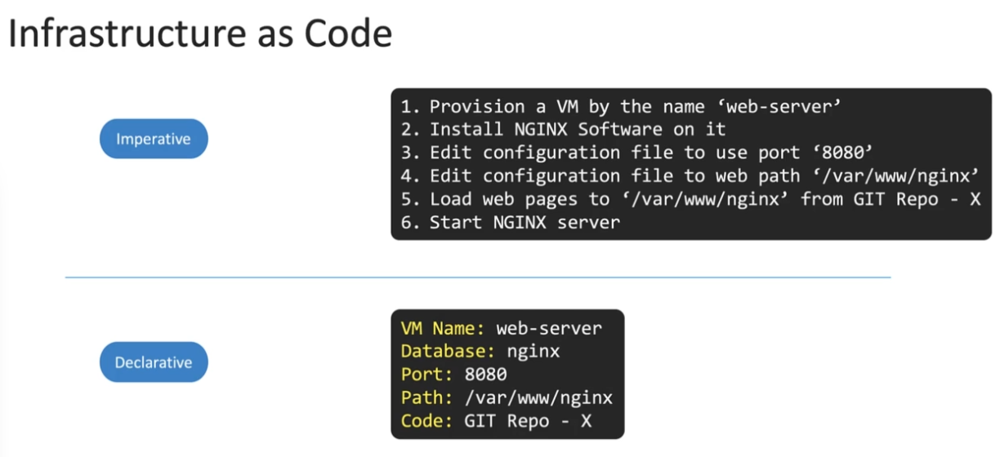

This is a test post used to verify the auto tag workflow on pull requests.

## What is this?

This post exists solely to trigger the GitHub Actions auto-tag workflow, which uses Claude to automatically assign relevant tags and a category to new blog posts.

## How it works

When a PR is opened that modifies files in `src/content/posts/`, the workflow:

1. Detects changed Markdown files
2. Reads all posts to build a tag frequency map
3. Assigns only tags that appear on at least one other post
4. Updates the frontmatter with up to 5 valid tags and a category

## Kubernetes node overview

The diagram below shows the high-level architecture of a Kubernetes node as referenced in CKA study notes.

## Topics covered

This post touches on DevOps practices, Kubernetes workflows, Linux tooling, and CI/CD pipelines — all common themes across this blog.

Feel free to delete this post after verifying the workflow runs successfully.
