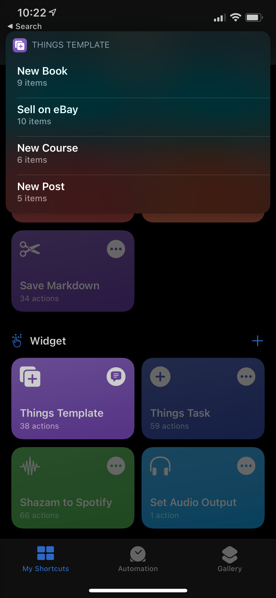

# Introduction

No to-do app has ever fully fit my needs, I always find something wrong with it. I have been using [Todoist](https://todoist.com) for years, but I have recently found it increasingly lacking, especially given the yearly subscription.

I switched to [Things 3](http://culturedcode.com/things/) a couple of months ago to see if it would fit my workflow better, as it seems to align better with the [Second Brain](https://fortelabs.co/blog/basboverview/) methodology.

Things 3 has better Siri Shortcut support as well as a proper [URL Scheme](https://culturedcode.com/things/support/articles/2803573/).

I have created 2 Siri Shortcuts that I use daily with Things, and I wanted to share them.

In this post I'm assuming that you, the reader, are familiar with Siri Shortcuts, what they are and what they do.

# Things Task

The first Shortcut is "Things Task". This is the main shortcut I use to add items to Things, even in the Share Sheet. This Shortcut is used instead of the official input method.

## Dependencies

There are no hard dependencies for this Shortcut. If you have selected to use a URL Scheme, you will need to make sure the app you are using is installed.

I use [‎Command Browser](https://apps.apple.com/gb/app/command-browser/id1485289520), so I have set my URL Scheme to `//command`.

If you have never heard of Command, I would highly recommend you check it out. I use it as a view later service. It also allows you to sync to [Notion](http://notion.so) or [Readwise](https://readwise.io/i/damir6) (ref link). Command is fully worth the small price tag. I have had a few issues, but the Developer was super responsive and fixed all the issues I had in a matter of days.

## Functionality

- If the input is a URL (from the Share Sheet)
    - Fetch the Title of the URL (this sadly results in a prompt for each new website)
    - Prompt when to add the Task for (Today, Evening, Tomorrow or Anytime (Inbox))
    - Ask if you want to add a [URL Scheme](https://developer.apple.com/documentation/xcode/allowing_apps_and_websites_to_link_to_your_content/defining_a_custom_url_scheme_for_your_app) (set up during installation)
- If the input is Text
    - Prompt for the Text
    - Prompt when to add the Task for (Today, Evening, Tomorrow or Anytime (Inbox))

The Shortcut uses Things URL Scheme mentioned in the Introduction.

## Download

[Shortcuts](https://www.icloud.com/shortcuts/dc5b74f0b1f0448fb26044099e394b53)

# Things Template

The second Shortcut I use is "Things Template". Like many other to-do apps, Things also doesn't include a templating system for those repeating tasks (and no, [Project Templates | Todoist](https://todoist.com/templates/) doesn't count, it is a horrible system, I am not doing that). But luckily, with Things and their URL Scheme, we can fix this.

## Dependencies

[Data Jar](https://datajar.app)

## Functionality

Let's go over the functionality.

When triggered, it will look at the template list I have stored in Data Jar and prompt for a selection from a dynamic list of templates.

I am using Data Jar as I wanted to avoid hard-coding values into the Shortcut.

Once you select an item it will ask you if you want to create a To-do or a Project.

If you select a "To-do" it will create a Task with Checklist items, if you select a "Project" it will create a Project with Tasks.

When you make the selection, it will ask you for the Task name.

After you make your input, the item is created.

## Data Jar Values

If for whatever reason you want to see/use my Data Jar values, download the backup (the easiest way to export items from what I could find), and restore the backup. I don't know if this will overwrite any existing values you have in Data Jar before restoring from backup.

[2021-03-16 10.19.datajar](Things%203%20Siri%20Shortcuts/2021-03-16_10.19.datajar)

## Download

[Shortcuts](https://www.icloud.com/shortcuts/a71c3fbf1ce24fa4bb2b89552a314ffd)

# Conclusion

There is one limitation that I haven't mentioned, and that is that these Shortcuts only work on the iPad and iPhone, but this means that even if you use the macOS version of Things ([https://culturedcode.com/things/mac/appstore](https://culturedcode.com/things/mac/appstore/)) (extremely overpriced (but still worth it)), you can't use it on macOS. Maybe in time, the new M1 Macs will get Shortcuts support?!?!?

No service/app can be perfect, but that is why it is nice when developers expand their app and add Shortcuts and URL Scheme support, so people like me can adapt it to fit our specific use case.

Hopefully, this post has been helpful to someone.

Liked the post? Interested in more? Follow me on [LinkedIn](https://www.linkedin.com/in/ddulic/)

Have a productive day and stay safe!
