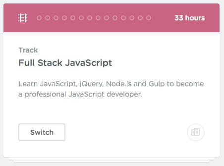

# Treehouse Review

There are lots of online learning platforms out there, but there are a few popular ones – [udemy](https://www.udemy.com/), [coursera](https://www.coursera.org/) and [treehouse](https://referrals.trhou.se/ddulic). I have used them all to a greater extent. I have left out [codeschool](https://www.codeschool.com/) and [linuxacademy](https://linuxacademy.com/) (I will be doing a review of Linux Academy as soon as I complete my first Official LPIC exam) because they don’t fall in the same category.

Likewise, I started using Treehouse a few months ago, did the 2-week trial period and didn’t use it after that, I liked it, but it didn’t stick, and the reason it didn’t stick is that I didn’t explore more of it. I was focused on doing a single course when in fact I didn’t really like the instructor and this pushed me away from the platform. Recently at my college, I started learning JavaScript, but because of work, I have little time to actually go to the lectures, so I was falling behind.

The answer? – treehouse. I enrolled again and searched for a JavaScript course. And did I find one – a track with 33 hours worth of JavaScript right there? Let’s take a look at what this includes. A track is made up of multiple courses. 

This specific one contains 14 courses! And each course is further made up of different parts. An example: Object-Oriented JavaScript contains 4 parts:

- Introduction to Methods
- Constructor Functions and Prototypes
- Prototypal Inheritance
- Practice Project

And each one of these contains multiple steps. A step can be a video (teaches you the material), question (asks you a few questions, if you get a few wrongs you have to redo the quiz) or an objective (this is where you do hands on coding, this is exclusive to the coding courses). The number of steps and their types varies from course to course. The quality of the videos, questions, and objectives also varies. I have found some to be wonderful and others to be just plain dumb, obviously rushed to just get the content out there. They also have their own text editor – Workspaces which changes depending on what video you are watching. This lets you follow along with the instructor and allows you to do everything in your browser, which is a huge + for me.

Now. Moving on to the certificates or lack thereof. Unlike udemy and coursera, treehouse does not use a certificate system. Instead, they have points. You can earn points in various ways, by watching videos, correctly answering questions, and doing objectives, as well as being active and giving correct answers on their forums. If you want to display your points, just give out a link to your [public profile](https://teamtreehouse.com/ddulic). All in all, I find Treehouse to be a good online learning platform. They offer a wide variety of courses and their way of trying to teach you seems to work great so far – at least for me 😀

And finally, the design and UX. A learning website should always incentivize you to learn more, do just one more step, just one more course. This is usually done via a great UX (User Experience) and holy 💩 do I love treehouse’s UX, it’s smooth with fluid transmissions which are consistent throughout the whole website.

---

---

---

---

Damir Dulic   |   Powered by [Notion](http://notion.so) & [Super](https://super.so?via=ddulic)
