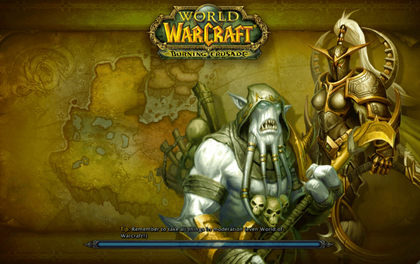

I have been playing a bit more games recently, and I realized something, playing WOW during my teens taught me a lot.

The reddit post that inspired this

[LPT: Sometimes it helps to think of life as a MMORPG. Facing a setback? Totally normal-it's part of the game. No way forward? Explore your surroundings. The game mindset allows you to take a step back from difficult situations and think about them strategically, and with clear-eyed objectivity.](https://www.reddit.com/r/LifeProTips/comments/jicmta/lpt_sometimes_it_helps_to_think_of_life_as_a/)

When I was a teenager I had an addiction, and it was World of Warcraft, playing 8+ hours most days.

I was pondering the other day about my days of playing World of Warcraft and the influence it most likely had on me...

This is going to get strange, I will try and relate stuff from WoW to my current situation, being an adult and all.

- Daily Quests; how small things accumulate over time (compounding interest, grit)
- Reputation; doing things for people (and orgs) gains trust
- Leading Dungeons and Raids;
    - it is hard it is to manage people
    - different classes are different types of people; you need a mix of personalities to achieve goals
- Add-ons and Macros; tools to increase my productivity and efficiency
- Gold; having more than you need gives you financial security
- Achievements; experience you can show on your CV, Blog, etc...

I am not sure where these mechanisms came from, I can imagine a lot of them are “reverse engineered” based on human behaviour, but it was fun to think of them in the ways listed above.

Please “Remember to take all things in moderation (even World of Warcraft)”.

This was strange, but fun, maybe I will more of these types of posts in the future, who knows.

Have a wonderful day.

---

---
