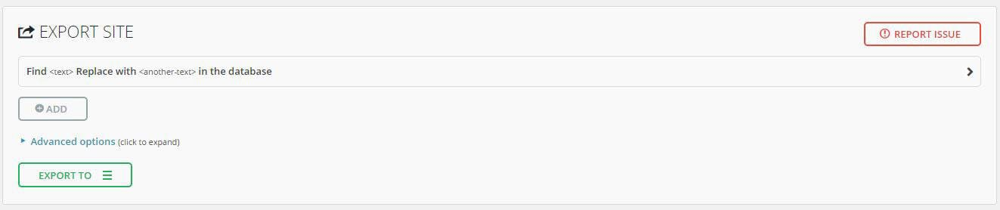

Many of you might have noticed that you are being redirected to a new domain – damir.tech. I think it's a bit better than the last one, the domain itself now both describes both me and what I do.

But I didn’t just want to change my domain name, I also wanted to change my server/droplet (I use [DigitalOcean](https://m.do.co/c/aff79d8ca2f0)) because the one I had my website running on has been destroyed with my constant tinkering. It worked, but it wasn’t happy, it was crying in pain 🙁

So, let’s get down to business. I thought that this was all going to be hard, but in fact, it was effortless. So don’t be afraid, even if mistakes are made, they can be corrected easily, well, at least if you are on [DigitalOcean](https://m.do.co/c/aff79d8ca2f0), or have backups.

# **The first**

part is WordPress. While doing some research on how to do this, I wanted to back out at this part, but then I stumbled upon a plugin, which made the process 10x easier. It’s called [All-in-One WP Migration](https://wordpress.org/plugins/all-in-one-wp-migration). Not only, does it offer an option to Export and Import, but see that Find and Replace text in the database on the image below?

It allows us to find a string during export and change it with another one. This is the crucial part of our transfer process because if you don’t change to the new domain from your old one, things will get broken and nothing will work. So, the WordPress part of this process takes literally less than 6 clicks in total.

**NOTE:** If your file is over 500 MB you won’t be able to import your website without paying, and it really isn’t cheap :/

# **The second**

part depends on your server, how easy it is to spin up a new, fresh server with WordPress. If you want to use [DigitalOcean](https://m.do.co/c/aff79d8ca2f0) (you see a trend here with the referral links, right?) it’s easy. All you have to do is create a new WordPress Droplet and complete the initial setup process. Connect your new domain to the new server via your Domain Control Panel – I would recommend using [CloudFlare](https://www.cloudflare.com/), I don’t like their caching and lack of gzipping files, but their DNS Panel is easy to use and their [Page Rules](https://support.cloudflare.com/hc/en-us/articles/218411427-Page-Rules-Tutorial) are solid. After that, go into WordPress Settings and under General change the 2 addresses listed to your new domain name. Now you can remove all the unnecessary stuff that comes with a fresh WordPress install and go ahead and install the [All-in-One WP Migration](https://wordpress.org/plugins/all-in-one-wp-migration/screenshots) plugin since we will need that to import the .wpress file we downloaded in the previous step. NOTE: If you use HTTPS, importing without setting up your domain and enabling SSL before uploading the .wpress file will again, break everything. So take care of that first. Importing the .wpress file is as easy as exporting. Upload will take a while depending on your internet connection and once it finishes just save your permalink settings, and you are done 🙂 **NOTE:** I use a plugin to change and hide my default WordPress login URL to prevent most of the bots trying to brute force into my admin area. If you also use a similar plugin DISABLE it before you export because once you finish uploading the .wpress file you won’t be able to continue the process and your site will again, break. This happens because WordPress seems to force a logout once the plugin is finished its stuff, (then again, the default account does also change, so this does make sense) but because you have not saved the permalink settings yet, the process isn’t completed to the very end, and since you are logged out, you cannot 🙁

# **The third**

step is to redirect people from your previous domain to your new one. This is easily done if you use Cloudflare to manage your DNS. Just create a Page Rule to redirect visitors from your old domain to your new one. The beauty of this is that you don’t even need a server running with nginx or Apache to redirect visitors if you use Cloudflare you just have to own the domain. And how long do you have to redirect? FOREVER. If you need help in how to set up Page Rules on Cloudflare feel free to leave a comment below, but it’s pretty straightforward 🙂

And you are all up and running. You have successfully swapped your domain name and the server, all while keeping WordPress the same. All that is left, if you care about [SEO](https://duckduckgo.com/?t=lm&q=SEO&ia=meanings) (and you should care), is to let Google know (no one cares about Bing) that you have swapped addresses, and you can do this via the [Google Change of Address](https://support.google.com/webmasters/answer/83106?hl=en) tool. If you have any question regarding this step, also feel free to ask 🙂

Cheers, have fun (*＾▽＾)／

---

---
